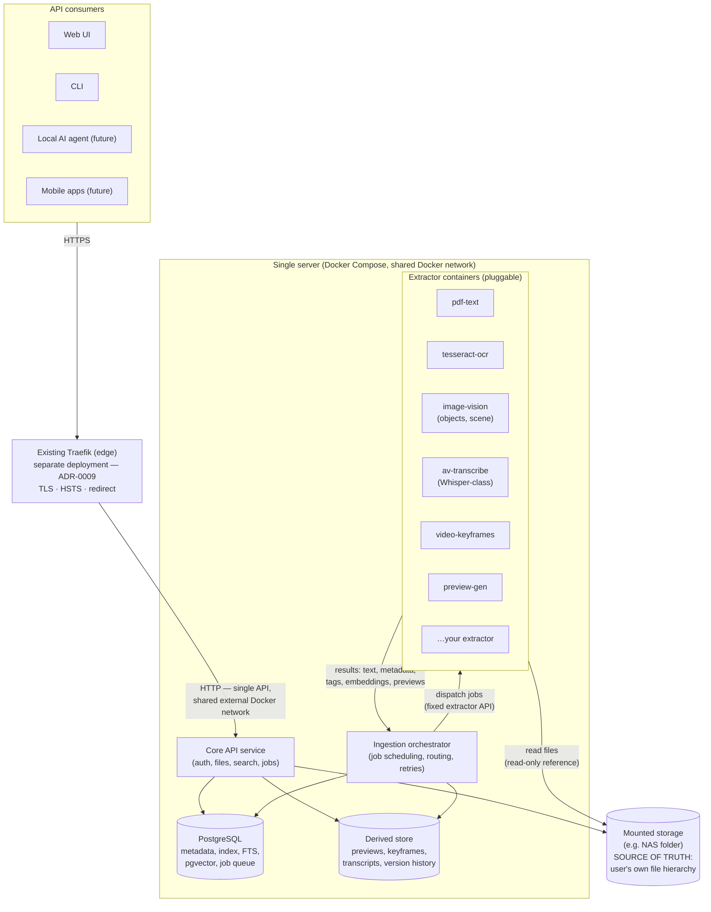

# 01 — Architecture Overview

**Status:** Draft
**Related ADRs:** [ADR-0001](../decisions/ADR-0001-postgresql-single-datastore.md), [ADR-0002](../decisions/ADR-0002-extractor-containers-fixed-api.md), [ADR-0003](../decisions/ADR-0003-files-on-disk-source-of-truth.md), [ADR-0005](../decisions/ADR-0005-single-server-docker-network.md), [ADR-0009](../decisions/ADR-0009-external-traefik-edge.md), [ADR-0010](../decisions/ADR-0010-crash-only-execution-model.md)

## Components

## Component responsibilities

| Component | Responsibility |
|---|---|
| **Traefik edge** *(pre-existing, not part of the app)* | TLS termination, HTTP→HTTPS redirect, HSTS, volumetric rate limiting. Only the core API joins its network ([ADR-0009](../decisions/ADR-0009-external-traefik-edge.md), [10](10-deployment-and-operations.md)). |
| **Core API service** | The single entry point. Authentication, workspace/file CRUD, tag management, search endpoint, sharing/links, job status. Serves file bytes and previews. Nothing exists that isn't reachable through this API (API-first). |
| **Ingestion orchestrator** | Watches for new/changed files, computes content hashes, routes files to matching extractors (by declared capabilities), manages async job lifecycle (retry, timeout, dead-letter), writes results into the index. See [04-ingestion-pipeline.md](04-ingestion-pipeline.md). |
| **PostgreSQL** | Single datastore: relational domain model, full-text search, vector search (pgvector/HNSW), typed metadata, permissions, and the job queue (`SKIP LOCKED`). One thing to install, back up, and keep consistent. See ADR-0001. |
| **Extractor containers** | Independent Docker containers, one capability each, implementing the fixed extractor API ([05-extractor-contract.md](05-extractor-contract.md)). Registered with the orchestrator; declare which MIME types they handle and what they produce. |
| **Mounted storage** | The user's real files in the user's real hierarchy. The app treats it as local folder(s). Never rewritten by extraction; originals are immutable from the app's perspective except through explicit user file operations. |
| **Derived store** | Everything regenerable that is too big for the database: preview images, video keyframes, transcript files, and app-managed version history. Lives *beside* the source data, clearly separated, deletable without losing originals. |

## Key architectural rules

1. **Two data planes.** *Source plane*: user files on mounted storage — sacred, portable, app-removable. *Derived plane*: PostgreSQL + derived store — 100 % regenerable by reprocessing (except manual input: manual tags, users, permissions, shares — which live in PostgreSQL and are covered by DB backup).
2. **Extractors are untrusted-ish plugins.** They get read-only access to file content and can only return structured results through the fixed API. By default they have no outbound network access (security-first; see OPEN-QUESTIONS Q7 for enforcement details).
3. **Everything async that touches content.** Extraction jobs run minutes-to-hours on CPU-only hardware. Upload/import never blocks on analysis; search facets appear as extraction completes ("this facet is pending", never "ingestion failed").
4. **Deployment target:** everything on one server in one Docker Compose setup, extractors on a shared Docker network (ADR-0005), behind an **existing external Traefik** — only the API container attaches to its network (ADR-0009, [10](10-deployment-and-operations.md)). The extractor contract must not *assume* co-location (file access is by reference), so moving extractors to other hosts later is a configuration change, not a redesign.
5. **GPU optional.** Extractors declare whether they can use a GPU; the same container must run (slower) on CPU-only hosts.
6. **Crash-only.** Any process may be killed at any instant without corruption, lost work, or duplicated effects: effectful operations are recorded durably before they start, every effect is idempotent, and recovery is the normal execution path — graceful shutdown is an optimization, never a correctness requirement ([ADR-0010](../decisions/ADR-0010-crash-only-execution-model.md), [12-reliability.md](12-reliability.md)).

## Technology direction

Rows with an ADR are decided; model choices stay open until phases 2–3 ([Q9](../OPEN-QUESTIONS.md)).

| Concern | Choice | Why |
|---|---|---|
| Datastore | PostgreSQL + pgvector | One dependency, transactional consistency between permissions and index ([ADR-0001](../decisions/ADR-0001-postgresql-single-datastore.md)) |
| Core service language/framework | **Python 3.13 + FastAPI** | No ML runs in the core (extractors own it), the reliability substrate is hand-written SQL in any language, and long-term maintainability follows maintainer fluency ([ADR-0012](../decisions/ADR-0012-python-fastapi-core-stack.md)) |
| Data access | SQLAlchemy Core + hand-written SQL, no ORM session | Lease claims and search need exact control over statements and transactions ([ADR-0012](../decisions/ADR-0012-python-fastapi-core-stack.md)) |
| Job queue / operations | Owned operation layer: `SKIP LOCKED` claims + heartbeat leases + fencing — **no queue library** | No extra broker; queue state in the same transaction as domain state; no library ships fencing, and the operation record is also the job-status and idempotency surface ([ADR-0010](../decisions/ADR-0010-crash-only-execution-model.md), [ADR-0013](../decisions/ADR-0013-owned-operation-layer.md), [12](12-reliability.md#leases--fencing)) |
| Web UI | Vue 3 SPA on Vite, typed client generated from OpenAPI | The baseline client; API access only through the generated client ([ADR-0014](../decisions/ADR-0014-vue-frontend-stack.md)) |
| Text embedding | Local sentence-embedding model (CPU-capable) *(model: Q9)* | Semantic doc search |
| Image/text shared space | CLIP-class local model *(model: Q9)* | "Photo of my dog at the beach" → image match |
| Transcription | Whisper-class local model *(model: Q9)* | Video/voice/MP3 → text with timestamps |
| OCR | Tesseract (baseline) | Scanned PDFs, images, video keyframes |
