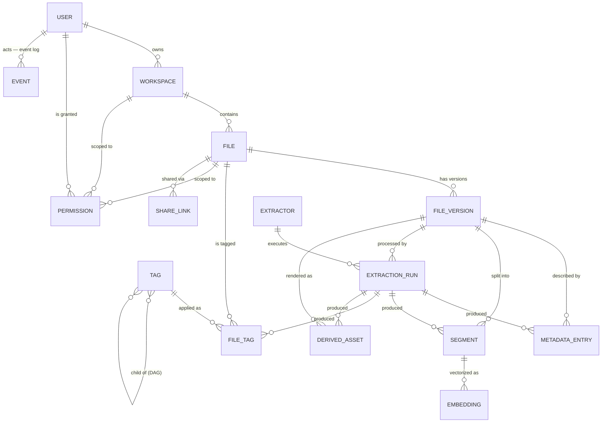

# 02 — Domain Model

**Status:** Draft
**Related ADRs:** [ADR-0003](../decisions/ADR-0003-files-on-disk-source-of-truth.md), [ADR-0004](../decisions/ADR-0004-tag-provenance-and-reprocessing.md)

## Entity relationship overview

## Entities

### User
An account on the instance (10–30 expected). Authenticates against the API. Owns workspaces.

### Workspace
The top-level container for files. **A file always belongs to exactly one workspace; a workspace always belongs to exactly one user.** Users upload into a specific workspace. A workspace maps to a directory subtree on the mounted storage and carries the user's own hierarchical folder structure.

> A workspace corresponds to a **top-level folder** and carries a **source type**: `local` (read+write — the folder *is* the storage) or `external` (e.g. GDrive: read-only through the app, fully mirrored onto the server; specified later — Q16). Fixed: ownership (one user) and containment (files live in exactly one). Still open: quotas, per-workspace settings, and where the auto-sort inbox's sorted output lives (Q2, [F-010](../features/F-010-auto-sort-inbox.md)).

### File
A logical file at a path inside a workspace. Has a current (latest) version and possibly older versions. Path, name, and hierarchy mirror the real folder structure on disk — the app never invents a structure the user can't see in the filesystem.

**Tags and metadata belong to the file (via its versions), not to the viewing user.** If Alice grants Bob write permission and Bob edits tags, Alice sees the updated tags. There is one shared truth per file.

**Identity:** every file receives a **UUID** at registration that survives renames, moves, and new versions (like Google Drive's `fileId` / Dropbox's `file_id`); the path is a mutable attribute. Tags, permissions, share links, and versions attach to the UUID — which is what makes `move` cheap and metadata move-invariant. External renames (done directly on disk) look like delete+create to a re-scan; the reconciler applies a move heuristic — a vanished file whose content hash reappears at a new path in the same workspace keeps its UUID — otherwise a new file is registered.

### FileVersion
An immutable snapshot of a file's content, identified by a **content hash** (e.g. BLAKE3). Created on upload, on detected change of the file on disk, or on explicit new-version upload. All derived data (metadata, segments, embeddings, derived assets) hangs off a version, so old versions stay searchable ([F-007](../features/F-007-versioning.md)). Search defaults to latest versions only.

The content hash is an *internal* mechanism: integrity checking, change detection, and reuse of extraction results when two versions have identical bytes. It is **not** cross-user shared storage — identical files in two workspaces are two files (see 00 non-goals).

### Tag / FileTag
`Tag` is a node in the **global, admin-governed tag vocabulary** — a DAG (multi-parent allowed, cycles rejected) used for structuring, query expansion, and finding the best tag ([ADR-0006](../decisions/ADR-0006-hierarchical-tags-dag.md)). Tags carry a status (`active` / `suggested` / `rejected`) and **aliases** (synonyms and model-label mappings to a canonical tag). **Files always carry a flat list of the most specific applicable tags** — ancestor tags are never materialized onto files; searching a broad tag expands to its descendants at query time. `suggested` tags (auto-tagger-created when no existing tag fits) are quarantined: shown on the file detail clearly marked as suggestions, excluded from search and autocomplete until an admin approves them.

`FileTag` is the application of a tag to a file, carrying provenance:

| Field | Meaning |
|---|---|
| `provenance` | `manual` \| `auto` \| `confirmed` \| `rejected` |
| `confidence` | 0–1, set for `auto` tags when the extractor provides one |
| `source` | extractor id + version + model version for `auto`; user id for `manual`/`confirmed`/`rejected` |
| `generation` | which extraction run/generation produced it (for `auto`) |

Rules (ADR-0004):
- `manual`: user-created. Survives all reprocessing.
- `auto`: extractor-created, labeled as such in every API response and UI, confidence stored alongside.
- `confirmed`: an `auto` tag the user approved — from then on treated exactly like `manual` (survives reprocessing).
- `rejected`: a *negative record*. When a user removes an auto tag, we store the rejection so reprocessing with the same or newer models does not silently re-add it.

### MetadataEntry
A typed key–value fact about a file version. Carries the same provenance stamping as tags (`auto`/`manual`, source = extractor id + version + model version or user id, confidence where derived, `extracted_at`). Users can add/edit metadata via the API (`manual` provenance, stored only in the table — never written back into the file); metadata edited *inside* a file with external tools is simply a content change (new version → re-extraction picks up the new values). Tags and metadata are **app-private**: they exist only in the app's database; export (e.g. XMP sidecars) is a possible later feature.

**Value types** — each determines indexing and available query operators:

| Type | Example keys | Query capability |
|---|---|---|
| `string` (keyword) | `camera`, `codec`, `language`, `author` | exact, prefix, facets |
| `text` (short prose) | `description`, scene caption | full-text (long text belongs in Segments, not metadata) |
| `integer` / `float` | `page_count`, `width`, `iso`, `bitrate` | equality, range |
| `boolean` | `has_text_layer`, `is_screenshot` | filter |
| `datetime` / `date` | `taken_at`, `document_date` | range, date-bucket facets |
| `duration` | `duration` | range |
| `geo` (lat/lon) | `gps` | radius / bounding box → map view |
| `json` (structured, opaque) | `detected_objects` (boxes, labels, confidences) | stored/retrievable; queryable *projections* are emitted separately (labels → tags) |

**Well-known key registry:** keys like `gps`, `taken_at`, `duration`, `dimensions`, `language` have a core-defined fixed type and unit. Any extractor may emit them; built-in features (map, timeline, duration filters) build on the *keys*, not on specific extractors. Unknown keys are still stored, typed, and searchable — they just don't power built-in UI.

Structured detections (objects, scenes) are stored as `json` metadata *and* surfaced as `auto` tags for searchability.

### Segment
The positional unit of search ([06-search.md](06-search.md)). A file version's searchable content is split into segments with **anchors**:

| File type | Segment | Anchor |
|---|---|---|
| Document/PDF | page or text chunk | page number (+ char offsets) |
| Audio/voice/MP3 | transcript span | start/end timestamp |
| Video | transcript span / keyframe | timestamp |
| Image | whole image / OCR block | region (optional) |
| Plain text/code | chunk | line range |

Segments carry the extracted text (for FTS) and are the unit that embeddings attach to. This is what lets search answer *"pages 1, 3 and 7"* and *"at 04:12"*.

### Embedding
A vector for a segment (or whole file) in a named **embedding space** (`text-v1`, `clip-v1`, …). Different spaces are never compared to each other; a query is embedded once per targeted space and results are fused (see 06).

### Extractor / ExtractionRun
`Extractor` is a registered plugin container: id, version, model version, capabilities (MIME types in, output kinds out), cost class, GPU usage. `ExtractionRun` is one execution of one extractor over one file version, with status, timings, errors, and a **generation number**. Reprocessing creates a new generation; the previous generation's outputs are kept until the new one is complete and can be rolled back to (ADR-0004).

### DerivedAsset
A generated artifact stored in the derived store: preview/thumbnail images, video keyframes, transcript files, waveform data. Addressed by file version + extractor + kind. Fully regenerable.

A special class is the **Rendition** ([ADR-0008](../decisions/ADR-0008-renditions.md)): a downloadable *alternative form of the whole file* — searchable PDF with embedded OCR text layer, subtitled video, `.srt` file. Renditions never replace the original (`/content` always serves untouched bytes); they are listed and downloaded via their own endpoint.

### Event
The append-only **event log** ([ADR-0007](../decisions/ADR-0007-unified-event-log.md)): every state-changing action (file operations, versions, tag/metadata edits, permission changes, share accesses, logins, extraction runs) is recorded in the same transaction as the change — actor (user, extractor, or system), action, resource, timestamp, details. One log, three consumers: the audit API ([F-011](../features/F-011-audit-trail.md), full fidelity), the `/events` cursor feed (sync clients, agents), and the WebSocket fan-out ([F-012](../features/F-012-live-updates.md), coalesced thin notifications).

### Permission / ShareLink
See [07-identity-permissions-sharing.md](07-identity-permissions-sharing.md). `Permission` grants a user a role (`read`/`write`/…) on a workspace, folder, or file. `ShareLink` is a public, token-based download link with optional expiry/password.

## Invariants

1. Every file belongs to exactly one workspace; every workspace to exactly one user.
2. Original file content is never modified or lost by the system. The only exception-shaped case — OCR on scanned PDFs — also does **not** modify the original: extracted text is stored as segments, never written back into the PDF.
3. All derived data is traceable: every `MetadataEntry`, auto `FileTag`, `Segment`, `Embedding`, and `DerivedAsset` references the `ExtractionRun` (extractor id + version + model + generation) that produced it.
4. `manual` and `confirmed` user input is never altered by reprocessing; `rejected` records suppress re-adding.
5. Anything derived (plane 2) can be deleted and rebuilt from the source plane + manual records.
6. Every state-changing action is recorded in the event log in the same transaction (ADR-0007) — nothing changes silently.
