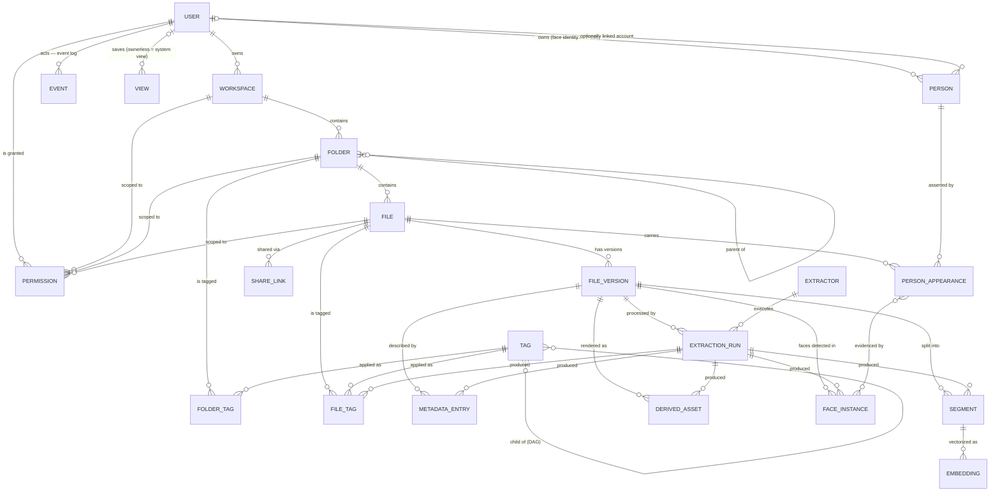

# 02 — Domain Model

**Status:** Draft
**Related ADRs:** [ADR-0003](../decisions/ADR-0003-files-on-disk-source-of-truth.md), [ADR-0004](../decisions/ADR-0004-tag-provenance-and-reprocessing.md)

## Entity relationship overview

## Entities

### User
An account on the instance (10–30 expected). Authenticates against the API. Owns workspaces.

### Workspace
The top-level container for files. **A file always belongs to exactly one workspace; a workspace always belongs to exactly one user.** Users upload into a specific workspace. A workspace maps to a directory subtree on the mounted storage and carries the user's own hierarchical folder structure.

> A workspace corresponds to a **top-level folder** and carries a **source type**: `local` (read+write — the folder *is* the storage) or `external` (e.g. GDrive: read-only through the app, fully mirrored onto the server; specified later — Q16). A `local` workspace additionally carries a **placement**: `managed` (its directory is ours, under `SE_DATA_ROOT`) or `adopted` (an existing directory indexed in place, admin-created inside an allow-list — [ADR-0018](../decisions/ADR-0018-workspace-layout-and-adoption.md), [03 § placement](03-storage-and-portability.md#placement-managed-and-adopted-roots)), plus the verdict of the filesystem probe that admitted it ([03 § filesystem requirements](03-storage-and-portability.md#filesystem-requirements)) and its scan schedule ([ADR-0019](../decisions/ADR-0019-source-tree-semantics.md)). A workspace also carries a **lifecycle state**: `provisioning` until its directory, control directory and root folder exist, then `active` ([03 § placement](03-storage-and-portability.md#placement-managed-and-adopted-roots)) — the row is the durable intent, and the operation that builds the tree is what makes it true. Fixed: ownership (one user) and containment (files live in exactly one). Still open: quotas and other per-workspace settings (Q57), and where the auto-sort inbox's sorted output lives (Q55, [F-010](../features/F-010-auto-sort-inbox.md)).

### Folder
A directory in a workspace's tree, mirrored 1:1 from disk — a first-class entity, not a path string ([F-015](../features/F-015-folders.md)). Defined by *(uuid, workspace, parent, name)*; every workspace has an auto-created root folder. Names follow the rules shared with files ([03 § names on disk](03-storage-and-portability.md#names-on-disk)): stored as found, unique among siblings on a **comparison key** (NFC-normalized, case-folded), which is what path lookups compare. The **UUID survives rename and move** (same rule as files), which is what folder-scoped permissions, folder tags (`FOLDER_TAG` — manual-only, extractors never run on folders), and future folder share links attach to. Ancestry is precomputed in a **closure table** (the ADR-0006 pattern) powering subtree permission checks, path-prefix filters, and cycle detection. Folders carry system-computed aggregates: a **direct** file count, computed per read and therefore exact, and a **recursive** count and size maintained asynchronously from a delta queue written in the same transaction as each change — eventually consistent, with an `as_of` stamp and a per-read `pending` flag ([F-015/FR-8](../features/F-015-folders.md), [12 § folder rollups](12-reliability.md#folder-rollups)). External renames are reconciled by a majority-content heuristic that transfers the UUID — a majority of the folder's files, or of the child folders whose own identity the same pass transferred, going to one newly registered directory ([F-015/FR-7](../features/F-015-folders.md)).

### File
A logical file, addressed as *(parent folder, name)*; its display path is **derived from the folder chain**, never an independently stored string that could drift. Has a current (latest) version and possibly older versions. Names and hierarchy mirror the real folder structure on disk — the app never invents a structure the user can't see in the filesystem.

**Lifecycle state:** `live` or `trashed` ([F-014](../features/F-014-deletion-and-trash.md)). Trashed items are excluded from every default query surface and safeguarded restorably; the trash record carries origin (in-app delete vs. detected missing on disk), actor, timestamp, batch id, and purge deadline. Purge removes the file and everything attached to it — only the event log remains.

**Tags and metadata belong to the file (via its versions), not to the viewing user.** If Alice grants Bob write permission and Bob edits tags, Alice sees the updated tags. There is one shared truth per file.

**Identity:** every file receives a **UUID** at registration that survives renames, moves, and new versions (like Google Drive's `fileId` / Dropbox's `file_id`); the path is a mutable attribute. Tags, permissions, share links, and versions attach to the UUID — which is what makes `move` cheap and metadata move-invariant. External renames (done directly on disk) look like delete+create to a re-scan; the reconciler applies a move heuristic — a vanished file whose content hash reappears at a new path in the same workspace keeps its UUID — otherwise a new file is registered ([F-001/FR-19](../features/F-001-upload-and-import.md)). Byte-identical files make the hash ambiguous, so the rule is most-specific-first: one candidate whose path is confirmed absent wins outright; among several, the one that **kept its name** wins, which is what recovers a renamed directory whose files share content (sibling names are unique within a folder, so each file matches its own former self); among several of those, the **oldest registration** wins. The last rule is arbitrary and deliberately so — the candidates are indistinguishable to a person as well — and the choice is recorded in the `file.moved` event, because matching is better than losing the identity that tags, grants and history hang on. A changed hash is never a move.

### FileVersion
An immutable snapshot of a file's content, identified by a **content hash** — **SHA-256**, stored with its algorithm so a future algorithm is an additive change rather than a migration. (SHA-256 over a faster tree hash is deliberate: the mobile clients compute the same hash natively for the `hash-check` endpoint — [F-021](../features/F-021-mobile-auto-upload.md) — and ingestion is IO-bound long before it is hash-bound.) Created on upload, on detected change of the file on disk, or on explicit new-version upload. All derived data (metadata, segments, embeddings, derived assets) hangs off a version, so old versions stay searchable ([F-007](../features/F-007-versioning.md)). Search defaults to latest versions only.

The content hash is an *internal* mechanism: integrity checking, change detection, and reuse of extraction results when two versions have identical bytes. It is **not** cross-user shared storage — identical files in two workspaces are two files (see 00 non-goals).

### Tag / FileTag
`Tag` is a node in the **global, admin-governed tag vocabulary** — a DAG (multi-parent allowed, cycles rejected) used for structuring, query expansion, and finding the best tag ([ADR-0006](../decisions/ADR-0006-hierarchical-tags-dag.md)). Tags carry a status (`active` / `suggested` / `rejected`) and **aliases** (synonyms and model-label mappings to a canonical tag). **Files always carry a flat list of the most specific applicable tags** — ancestor tags are never materialized onto files; searching a broad tag expands to its descendants at query time. `suggested` tags (auto-tagger-created when no existing tag fits) are quarantined: shown on the file detail clearly marked as suggestions, excluded from search and autocomplete until an admin approves them.

`FileTag` is the application of a tag to a file, carrying provenance:

| Field | Meaning |
|---|---|
| `provenance` | `manual` \| `auto` \| `confirmed` \| `rejected` |
| `confidence` | 0–1, set for `auto` tags when the extractor provides one |
| `source` | extractor id + version + model version for `auto`; user id for `manual`/`confirmed`/`rejected` |
| `generation` | which extraction run/generation produced it (for `auto`) |

Rules (ADR-0004):
- `manual`: user-created. Survives all reprocessing.
- `auto`: extractor-created, labeled as such in every API response and UI, confidence stored alongside.
- `confirmed`: an `auto` tag the user approved — from then on treated exactly like `manual` (survives reprocessing).
- `rejected`: a *negative record*. When a user removes an auto tag, we store the rejection so reprocessing with the same or newer models does not silently re-add it.

### MetadataEntry
A typed key–value fact about a file version. Carries the same provenance stamping as tags (`auto`/`manual`, source = extractor id + version + model version or user id, confidence where derived, `extracted_at`). Users can add/edit metadata via the API (`manual` provenance, stored only in the table — never written back into the file); metadata edited *inside* a file with external tools is simply a content change (new version → re-extraction picks up the new values). Tags and metadata are **app-private**: they exist only in the app's database; export (e.g. XMP sidecars) is a possible later feature.

**Value types** — each determines indexing and available query operators:

| Type | Example keys | Query capability |
|---|---|---|
| `string` (keyword) | `camera`, `codec`, `language`, `author` | exact, prefix, facets |
| `text` (short prose) | `description`, scene caption | full-text (long text belongs in Segments, not metadata) |
| `integer` / `float` | `page_count`, `width`, `iso`, `bitrate` | equality, range |
| `boolean` | `has_text_layer`, `is_screenshot` | filter |
| `datetime` / `date` | `taken_at`, `document_date` | range, date-bucket facets |
| `duration` | `duration` | range |
| `geo` (lat/lon) | `gps` | radius / bounding box → map view |
| `json` (structured, opaque) | `detected_objects` (boxes, labels, confidences) | stored/retrievable; queryable *projections* are emitted separately (labels → tags) |

**Well-known key registry:** keys like `gps`, `taken_at`, `duration`, `dimensions`, `language`, `placeholder_hash` ([09](09-previews.md#thumbnails)), the OCR-routing pair `needs_ocr`/`ocr_pages` (written by `pdf-text`, bound by `tesseract-ocr`'s manifest predicate — [05](05-extractor-contract.md#dispatch--wire-protocol-extractor-apiv1)), and `detected_media_type` (content-derived correction of the extension-guessed type — [04 § identification](04-ingestion-pipeline.md#2-identification)) have a core-defined fixed type and unit. Any extractor may emit them; built-in features (map, timeline, duration filters) build on the *keys*, not on specific extractors. **Paired captures** (Live Photo pairs, RAW+JPEG) are linked by the asset-group keys — `asset_group` (group id), `group_role`, `group_kind` — stamped by whichever writer knows the truth (the uploading client today, a pairing extractor later); clients render a group as one item ([13-mobile-clients](13-mobile-clients.md#paired-captures-asset-groups)). Unknown keys are still stored, typed, and searchable — they just don't power built-in UI. One key is core-assigned rather than extracted: **`class`** — the coarse media class (`image | video | audio | document | archive | other`), derived from the detected MIME type at identification ([04](04-ingestion-pipeline.md#2-identification)) so it exists before any extractor runs; the default library pages ([F-017](../features/F-017-views.md)) build on it.

Structured detections (objects, scenes) are stored as `json` metadata *and* surfaced as `auto` tags for searchability.

### Segment
The positional unit of search ([06-search.md](06-search.md)). A file version's searchable content is split into segments with **anchors**:

| File type | Segment | Anchor |
|---|---|---|
| Document/PDF | page or text chunk | page number (+ char offsets) |
| Audio/voice/MP3 | transcript span | start/end timestamp |
| Video | transcript span / keyframe | timestamp |
| Image | whole image / OCR block | region (optional) |
| Plain text/code | chunk | line range |
| Spreadsheet | rows of one sheet | sheet + row range |

Segments carry the extracted text (for FTS) and are the unit that embeddings attach to. This is what lets search answer *"pages 1, 3 and 7"* and *"at 04:12"*.

### Embedding
A vector for a segment, a face instance ([F-018](../features/F-018-people.md)), or a whole file in a named **embedding space** (`text-v1`, `clip-v1`, `face-v1`, …). Different spaces are never compared to each other; a query is embedded once per targeted space and results are fused (see 06). `face-v1` is matching-only — never a target of query-text embedding ([06](06-search.md#embedding-spaces-never-mixed)).

### Person / FaceInstance / PersonAppearance ([F-018](../features/F-018-people.md) — deferred)
Face recognition data, existing only under the [F-018](../features/F-018-people.md) enablement gates — no row is created or exposed for workspaces where person recognition is not effectively enabled ([F-018/FR-3](../features/F-018-people.md)).

- **FaceInstance** — machine evidence, per file version: normalized bounding box, detection-quality score, `face-v1` embedding computed from the face region only, face-crop derived asset, timestamp for keyframe-sourced instances. Generation-scoped like segments/embeddings: reprocessing swaps a file's instances atomically ([F-018/FR-16](../features/F-018-people.md)).
- **Person** — a face identity **owned by a user** (the owner of the workspaces the faces came from — never instance-global, never cross-owner; [ADR-0011](../decisions/ADR-0011-person-recognition-architecture.md)): nullable display name (unnamed = auto-created cluster), hidden flag, cover face, optional **linked instance account** (the only cross-owner join, [F-018/FR-31](../features/F-018-people.md)).
- **PersonAppearance** — the assertion "this person is in this file", per (file, person), carrying the [ADR-0004](../decisions/ADR-0004-tag-provenance-and-reprocessing.md) provenance state machine (`manual | auto | confirmed | rejected`, confidence, source stamp) exactly like `FileTag`; linked to supporting face instances for anchors, valid without any (anchor-less manual assertions, re-anchoring fallback — [F-018/FR-16, FR-23](../features/F-018-people.md)).

### Extractor / ExtractionRun
`Extractor` is a registered plugin container: id, version, model version, capabilities (MIME types in, output kinds out), cost class, GPU usage — registered by manifest upsert under a per-extractor token, with rendition kinds, derived-asset kinds, and embedding spaces enforced single-provider ([05 § registration](05-extractor-contract.md#registration--authentication)). `ExtractionRun` is one execution of one extractor over one file version, with status, timings, errors, and a **generation number**. It is created 1:1 with its queue job (same id) and outlives queue-hygiene pruning of terminal operation rows (Q33) — the run is the provenance anchor every derived row references (invariant 3). Reprocessing creates a new generation; the previous generation's outputs are kept until the new one is complete and can be rolled back to (ADR-0004).

### DerivedAsset
A generated artifact stored in the derived store: preview/thumbnail images, video keyframes, transcript files, waveform data. Addressed by file version + extractor + kind. Fully regenerable.

A special class is the **Rendition** ([ADR-0008](../decisions/ADR-0008-renditions.md)): a downloadable *alternative form of the whole file* — searchable PDF with embedded OCR text layer, subtitled video, `.srt` file. Renditions never replace the original (`/content` always serves untouched bytes); they are listed and downloaded via their own endpoint.

### Event
The append-only **event log** ([ADR-0007](../decisions/ADR-0007-unified-event-log.md)): every state-changing action (file operations, versions, tag/metadata edits, permission changes, share accesses, logins, extraction runs) is recorded in the same transaction as the change — actor (user, extractor, or system), action, resource, timestamp, details. One log, three consumers: the audit API ([F-011](../features/F-011-audit-trail.md), full fidelity), the `/events` cursor feed (sync clients, agents), and the WebSocket fan-out ([F-012](../features/F-012-live-updates.md), coalesced thin notifications).

### Permission / ShareLink
See [07-identity-permissions-sharing.md](07-identity-permissions-sharing.md). `Permission` grants a user a role (`read`/`write`/…) on a workspace, a folder (by UUID — the grant survives rename and move, evaluated via the folder closure), or a file. `ShareLink` is a public, token-based download link with optional expiry/password; links on trashed files are suspended, not revoked ([F-014/FR-11](../features/F-014-deletion-and-trash.md)).

### View
A named, stored search request plus presentation hints ([F-017](../features/F-017-views.md)): owner (null for instance-provided **system views** — the seeded library pages), `name`, `request` (validated against the `POST /search` schema and executable verbatim), `layout` (`grid | list | map | timeline`). Views hold configuration only, never results — execution is an ordinary permission-filtered search, so a view grants nothing ([F-017/FR-5](../features/F-017-views.md)). Per-user navigation state (`hidden`, `position`) is stored per *(user, navigation entry)* and also covers the dedicated pages (browse, trash, duplicates, shared with me — [F-008/FR-11](../features/F-008-sharing-and-public-links.md)), which are not views ([F-017 § What is a view](../features/F-017-views.md#what-is-a-view--and-what-is-not)).

## Invariants

1. Every file belongs to exactly one folder, every folder to exactly one workspace, every workspace to exactly one user.
2. Original file content is never modified or lost by the system. The only exception-shaped case — OCR on scanned PDFs — also does **not** modify the original: extracted text is stored as segments, never written back into the PDF.
3. All derived data is traceable: every `MetadataEntry`, auto `FileTag`, `Segment`, `Embedding`, `FaceInstance`, and `DerivedAsset` references the `ExtractionRun` (extractor id + version + model + generation) that produced it.
4. `manual` and `confirmed` user input is never altered by reprocessing; `rejected` records suppress re-adding.
5. Anything derived (plane 2) can be deleted and rebuilt from the source plane + manual records.
6. Every state-changing action is recorded in the event log in the same transaction (ADR-0007) — nothing changes silently.
7. Trashed items appear in **no** default query surface — search results, facets, counts, autocomplete, duplicate groups — enforced inside the queries, including vector search. Purge removes every domain row and every stored byte (version blobs reference-counted); the event log is the only remaining trace, and a purged id is indistinguishable from one that never existed ([F-014](../features/F-014-deletion-and-trash.md)).
8. **App-written bytes outlive the rows that reference them.** The app never commits a row referencing content it has not durably written (bytes first, then the row) and never removes stored bytes before every referencing row is gone (rows first, then the bytes) — orphans are always harmless files awaiting GC, never dangling references ([ADR-0010](../decisions/ADR-0010-crash-only-execution-model.md), [12](12-reliability.md#filesystem-write-protocol)). Content that vanishes *outside* the app (deleted directly on the NAS) is the reconciled exception, surfaced as `restorable: false` ([03](03-storage-and-portability.md#versioning-vs-the-folder-is-everything-known-tension), [F-014/FR-10](../features/F-014-deletion-and-trash.md)).
9. Face data exists only under enablement: no `FaceInstance`, face embedding, face crop, or `PersonAppearance` is created for — or exposed from — files in workspaces where person recognition is not effectively enabled ([F-018/FR-3](../features/F-018-people.md)); the owner-triggered purge removes every such row and stored byte, leaving only the event log ([F-018/FR-6](../features/F-018-people.md)).
10. A `PersonAppearance` only ever references a `Person` owned by the file's **current** workspace owner, and identity resolution never links face instances across owners ([F-018/FR-14, FR-17](../features/F-018-people.md), [ADR-0011](../decisions/ADR-0011-person-recognition-architecture.md)).
