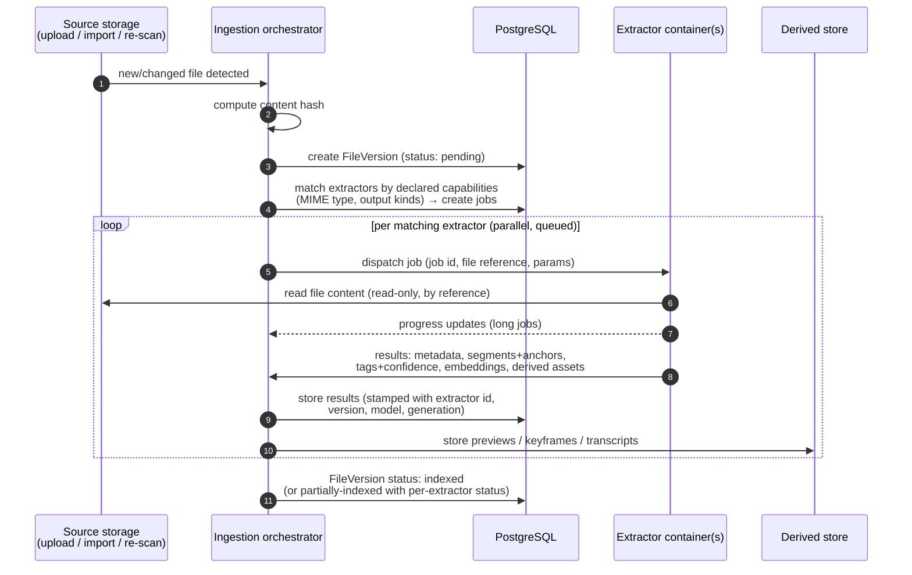
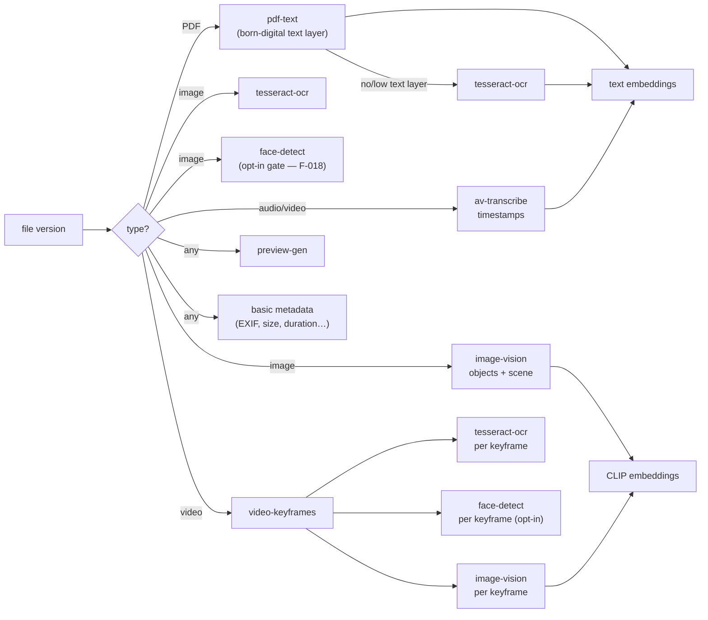

# 04 — Ingestion Pipeline

**Status:** Draft
**Related ADRs:** [ADR-0002](../decisions/ADR-0002-extractor-containers-fixed-api.md), [ADR-0004](../decisions/ADR-0004-tag-provenance-and-reprocessing.md)

## Overview

Ingestion turns a new or changed file into a fully indexed one. It is **always asynchronous**: uploads/imports return immediately, analysis runs in a background queue, and search facets appear as extraction completes. On CPU-only hardware a large video may take hours to transcribe — that is acceptable by design; search speed *after* indexing is what matters.

## Stages

### 1. Detection
Triggers: API upload completed · workspace import scan · re-scan reconciliation (file changed on disk) · explicit reprocess request. All converge on: *this file version needs (re)processing.*

### 2. Identification
Compute content hash → create/find `FileVersion`. If a version with identical hash was already fully extracted (e.g. a copy of an existing file), extraction results can be **reused** instead of recomputed — recorded as this file's own derived data, sourced from the cached run.

Identification also assigns the **media class** — a well-known metadata value ([02](02-domain-model.md#metadataentry)) derived from the detected MIME type by this core-owned mapping, present before any extractor runs so type-scoped listings work the moment a file appears ([F-002/FR-15](../features/F-002-hybrid-search.md), [F-017](../features/F-017-views.md)):

| Class | MIME rule |
|---|---|
| `image` | `image/*` |
| `video` | `video/*` |
| `audio` | `audio/*` |
| `document` | `text/*` · `application/pdf` · office, OpenDocument, RTF, EPUB families |
| `archive` | zip, tar, gzip, bzip2, xz, 7z, rar |
| `other` | everything else, including undetectable MIME |

The exact MIME list ships with the core and is versioned with it; a mapping change on upgrade re-derives stored classes directly in the database — a metadata update, never an extraction re-run.

### 3. Routing
The orchestrator matches the file against **registered extractor capabilities** (declared MIME types/extensions + produced output kinds — see [05-extractor-contract.md](05-extractor-contract.md)). Only matching extractors get jobs — a PDF never visits the transcriber. Routing also handles **chaining**: some extractors consume other extractors' outputs, not (only) the original file:

Notes:
- **PDF is a decision tree, not one tool**: born-digital PDFs use the text layer (faster, more accurate); Tesseract handles scans/photographed pages, decided per document (or per page).
- **Every image gets OCR and vision analysis** — including video keyframes, so on-screen text and visible objects in videos become searchable at their timestamp.
- How chaining is declared in the contract (input = original vs. derived asset kind) is part of Q5.
- **Face detection is gate-checked at routing**: `face-detect` jobs are created only for files whose workspace is effectively enabled ([F-018/FR-3](../features/F-018-people.md)). Completed face results trigger **identity resolution** — a *core-owned* incremental follow-up job (never an extractor — [ADR-0011](../decisions/ADR-0011-person-recognition-architecture.md)) that groups face instances into per-owner persons under the same crash-only queue rules ([12](12-reliability.md)), idempotent so re-runs converge.

### 4. Execution
Jobs are queued in PostgreSQL and executed under the crash-only model ([ADR-0010](../decisions/ADR-0010-crash-only-execution-model.md); mechanics in [12](12-reliability.md#leases--fencing)). `SKIP LOCKED` is only the *claim* instant — ownership is a **lease** (`leased_by`, `lease_expires_at`, `attempt`) extended by heartbeats; an expired lease makes the job claimable by anyone, and that reclaim branch *is* the recovery story — there is no separate startup-recovery pass. **Attempts count on claim, not on failure**: a poison job that OOM-kills its worker dead-letters after `max_attempts` even though it never reported an error. Every write-back (heartbeat, result) carries the claim's `attempt` as a **fencing token**, so a worker that lost its lease is rejected instead of clobbering the re-run. Idempotency keys are deterministic — `hash(file_version, extractor id+version, model version, generation, params)` — so re-detecting the same work converges on the pending job instead of duplicating it. Per-extractor concurrency limits, timeouts, retries with backoff + jitter, and the dead-letter state are API-visible. An offline extractor degrades to "facet pending" — never "ingestion failed". Cost classes let the scheduler keep cheap extractors (metadata, previews) fast while heavy ones (transcription) chew through their backlog. Restarts are routine: on SIGTERM the orchestrator stops claiming and releases its leases so a successor re-claims instantly (**at-least-once**, deduplicated on write — [05](05-extractor-contract.md#job-lifecycle)); `kill -9` is equally safe, just slower to detect. An upgrade mid-transcription costs a re-run, never consistency.

### 5. Persistence
Every result row is stamped: extractor id, extractor version, model version, `ExtractionRun` id, generation, confidence (where applicable). Detected objects/scenes are stored as structured metadata *and* surfaced as `auto` tags.

## Reprocessing (generations)

When a better model/extractor version arrives ([F-009](../features/F-009-reprocessing.md)):

1. User (or admin) triggers reprocessing — scoped by extractor, file type, workspace, or everything. Capability-based routing makes this selective: a new image model reruns `image-vision` over images only, not the whole 10 TB.
2. New `ExtractionRun`s execute with an incremented **generation**.
3. On completion per file: new-generation `auto` outputs replace the previous generation's `auto` outputs. The old generation is kept (rollbackable) until explicitly pruned.
4. **Never touched:** `manual` and `confirmed` tags, and any user edits. **Respected:** `rejected` records — a rejected auto tag is not re-added by a new generation.

## Prioritization & scheduling

The queue is priority-scheduled so the app always feels fast: cheap, user-visible work first; heavy work only when there is spare capacity.

| Class | Work | Why |
|---|---|---|
| **P0 — interactive** | user-triggered on-demand jobs: PDF page render being viewed, "Generate" for a heavy rendition | someone is waiting right now |
| **P1 — presence** | basic metadata, thumbnails, image previews, waveforms, scrub sheets | new files must appear browsable immediately |
| **P2 — searchability** | text extraction, OCR, embeddings, transcription, face detection & identity resolution ([F-018](../features/F-018-people.md), opt-in) | the product is search |
| **P3 — heavy derived** | video preview transcodes, pre-generated heavy renditions | idle-time only |
| **P4 — reprocessing** | generation reruns | never outranks fresh content |

Rules:

- Strict priority between classes; fair ordering within a class.
- **Reserved headroom instead of preemption:** heavy classes (P3/P4) are capped below the total worker count, so arriving P0–P2 jobs never wait behind a wall of transcodes. Running heavy jobs are never killed (wasted work) — they just cannot occupy every slot.
- The API/search service keeps guaranteed CPU headroom apart from the worker pool (separate containers, CPU limits): background load must never make search or browsing sluggish.
- Priority is assigned by the **core** from (output kind, trigger) — extractors declare `cost_class`, they don't pick their priority.
- **Configuration (admin):** per-class and per-extractor concurrency caps, pause/resume per queue (Immich-style). Sensible defaults so nobody has to touch it. Time-window scheduling ("heavy jobs only 22:00–06:00", Plex-style) is a later addition (Q17).

Prior art: Immich (per-job-type concurrency in admin UI), Plex (nightly butler tasks), Nextcloud (preview generation via cron).

## Status & observability (API-visible)

- Per file version: which extractors ran/pending/failed, timings, errors.
- Per extractor: queue depth, throughput, failure rate.
- Instance-wide: ingestion backlog (important during a 10 TB initial import).
