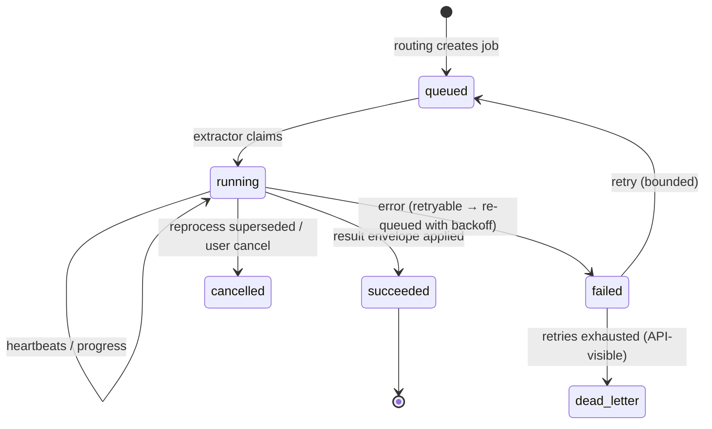

# 05 — Extractor Contract (Fixed Plugin API)

**Status:** Draft
**Related ADRs:** [ADR-0002](../decisions/ADR-0002-extractor-containers-fixed-api.md), [ADR-0005](../decisions/ADR-0005-single-server-docker-network.md), [ADR-0020](../decisions/ADR-0020-extractor-dispatch-and-wire-protocol.md), [ADR-0021](../decisions/ADR-0021-extractor-sandbox-enforcement.md)

## Principles

An **extractor** is a separate Docker container that adds one analysis capability to the system. Extractors and the core share **only one fixed API** — this is the plugin boundary that makes the system extensible without touching the core.

1. **Fixed, versioned contract.** The extractor API itself carries a version (`extractor-api/v1`); extractors declare which contract version they speak. The API is served by the core at `/extractor-api/v1/*` with its **own OpenAPI document** — a separate contract for a separate audience (extractor authors, the conformance kit), never part of the user-facing schema.
2. **Pull-based file access.** The core never streams file bytes *into* an extractor. It hands over **read-only input references** in the job payload; the extractor pulls the bytes (or ranges) it needs. References resolve to per-job, Range-capable HTTP URLs on the extractor API — never filesystem mounts ([ADR-0021](../decisions/ADR-0021-extractor-sandbox-enforcement.md); a same-host scratch handoff is a possible later optimization, [Q60](../OPEN-QUESTIONS.md)). The contract is location-agnostic: a remote extractor resolves references identically.
3. **Poll-based dispatch, async job lifecycle.** Jobs run seconds to hours. The extractor claims work, heartbeats progress, and submits results ([ADR-0020](../decisions/ADR-0020-extractor-dispatch-and-wire-protocol.md)) — with idempotency keys, fencing, and cancellation. The core never initiates a connection to an extractor.
4. **Declared capabilities.** Extractors are *registered*, not broadcast to. Routing is driven by their manifest.
5. **Isolated by default.** Read-only per-job file access, no outbound network unless explicitly configured (a remote-AI extractor is exactly that: an explicitly network-enabled extractor). Enforcement: [ADR-0021](../decisions/ADR-0021-extractor-sandbox-enforcement.md).

## Registration & authentication

- **An admin provisions the extractor id first**, and minting its credential is part of that act (`POST /api/v1/extractors`, admin-only). Nothing registers itself into existence: a token is bound to one id at mint time, so a leaked credential can neither invent a second extractor nor stamp another's provenance.
- Every extractor authenticates with a **per-extractor bearer token**, shown once like a personal access token; the token is delivery configuration (env), never manifest content. A token can register, claim, and write **only its own extractor id**. Tokens are listable, rotatable (mint the replacement, restart the container, revoke the old one) and revocable: `GET·POST /api/v1/extractors/{id}/tokens`, `DELETE /api/v1/extractors/{id}/tokens/{token}`.
- On startup the extractor performs an idempotent **manifest upsert** (`PUT /extractor-api/v1/registration`). A changed `version` or `model.version` is recorded — that is what makes files eligible for reprocessing by this extractor ([F-009/FR-2](../features/F-009-reprocessing.md)). A re-declaration of an identical manifest is *silent*: containers restart, and the event log is the one table nothing deletes.
- **`enabled` means exactly one thing** — whether the core routes work to this extractor (`PATCH /api/v1/extractors/{id}`). A disabled extractor still authenticates and still registers, so its manifest stays current and re-enabling needs no restart; this is how `face-detect` ships installed but inactive ([ADR-0011](../decisions/ADR-0011-person-recognition-architecture.md)). There is no delete: an extractor id is stamped into the provenance of every row it produced ([02 § invariants](02-domain-model.md#invariants) #3).
- **Single-provider kinds:** rendition kinds, derived-asset kinds, and embedding spaces have exactly one registered producer. A manifest claiming a kind already claimed by a *different* extractor id is refused with a conflict error naming the current claimant; the admin resolves by revoking or re-scoping one of the two. (Segments, metadata, and tags are deliberately multi-producer — every row is stamped with its run.)
- The admin extractor list (`GET /api/v1/extractors`) surfaces each registered manifest — including the `network` flag — plus token binding, last-seen, and queue/failure counts ([04 § status](04-ingestion-pipeline.md#status--observability-api-visible)).

## Manifest (registration)

Each extractor declares:

```yaml
id: image-vision
version: 1.4.0                # extractor implementation version
api_version: v1               # extractor contract version
model:
  name: yolo-something
  version: 8.2                # model version — part of every result's provenance
accepts:
  mime_types: ["image/*"]
  derived_kinds: ["keyframe"] # can also consume other extractors' outputs (chaining)
  # optional routing predicate on well-known metadata keys of the same file version
  # (evaluated as prior results land — how pdf-text hands scanned pages to OCR):
  # when: {key: needs_ocr, equals: true}
  # params_from: {pages: ocr_pages}   # copies a well-known key into job params
produces: [metadata, tags, embeddings]   # of: metadata | text_segments | tags | embeddings | derived_assets | renditions | faces
renditions: []                # if producing renditions: [{kind, format, label}] (ADR-0008)
derived_asset_kinds: []       # if producing derived assets: the kinds, e.g. ["keyframe"]
embedding_spaces: ["clip-v1"] # if producing embeddings
cost_class: heavy             # light | medium | heavy — scheduler hint
gpu: optional                 # none | optional | required
network: none                 # none | outbound (explicit opt-in, visible to admin)
```

Changing `version` or `model.version` is what makes files eligible for reprocessing by this extractor.

An output kind and the names it produces under arrive **together**: declaring `renditions`, `derived_assets` or `embeddings` in `produces` requires the matching list, and a list without its output kind is refused — otherwise a manifest could claim a namespace it never writes to, or declare an output nothing could ever be routed for. `derived_asset_kinds` is the output side of `accepts.derived_kinds`, which is what makes chaining a match between two manifests (keyframes → image analysis) rather than knowledge in the core.

## Container requirements (hardening)

Extractor images — official and third-party — follow the same container baseline as the core:

- Run as a **non-root** user; base image **pinned by digest**; no secrets in image layers.
- File access is read-only and per-job (principle 2); **no outbound network** unless the manifest declares `network: outbound` — an explicit, admin-visible opt-in ([ADR-0021](../decisions/ADR-0021-extractor-sandbox-enforcement.md): dedicated `internal: true` network, hardening template, Docker Engine ≥ 25.0.5).
- All configuration via environment variables. Credentials for network-enabled extractors (remote AI backends) are env-provided at deploy time — **never in the manifest, never logged** (Q19).
- An extractor that parses hostile content in a long-running process should isolate per file internally (fork-per-job, Tika's child-process model) — a parser crash then costs one job's lease, not the service.
- The official extractor images are dependency- and image-scanned in CI ([11](11-engineering-standards.md#ci-pipeline-the-enforcement-list)).

## Dispatch & wire protocol (`extractor-api/v1`)

The extraction queue *is* the operation layer ([ADR-0013](../decisions/ADR-0013-owned-operation-layer.md)): a job is an operation row of kind `extract.{extractor-id}`, created 1:1 with its durable `ExtractionRun` provenance anchor ([02](02-domain-model.md#extractor--extractionrun)). The extractor is the worker:

| Call | Semantics |
|---|---|
| `PUT /registration` | Manifest upsert (see above) |
| `POST /jobs/claim` | Claim the next job for this extractor (`204` when none). Returns the job payload: job id, **`attempt`** (the fencing token — [12](12-reliability.md#leases--fencing)), idempotency key, file version (id, content hash, media type/class, size, whether it is still current), input references, generation, params, the lease's expiry and the heartbeat interval to keep it, and the relevant well-known metadata. An optional bounded `wait` (≤ 30 s) long-polls; the wait holds no database connection, so idle extractors cost nothing. A **disabled** extractor is refused with a typed `409` rather than told there is no work — "switched off" and "nothing to do" are different answers to an operator |
| `POST /jobs/{id}/heartbeat` | Extends the lease and returns the cancellation verdict (`{cancel: bool}` — user cancel, supersession by a newer version or generation). **Required at least every half lease interval** during work |
| `GET /jobs/{id}/inputs/{n}` | Streams one input — original bytes or a chained derived asset — with Range support, scoped to this job. Which bytes follows the *version*, not the path: the source tree while the version is current, the app's own copy in `versions/` once it is superseded, and `410` when neither holds it any more |
| `PUT /jobs/{id}/assets/{sha256}` | Stages one derived-asset payload by content hash (idempotent; the core verifies the hash on receipt) — phase one of the two-phase result |
| `POST /jobs/{id}/result` | Submits the one result envelope referencing staged assets — applied in **one guarded transaction** (see below) |
| `POST /jobs/{id}/error` | Reports failure (`retryable` or not) → retry with backoff, or dead-letter |

Every write-back (`heartbeat`, `assets`, `result`, `error`) carries the claim's `attempt`; a call from a lost lease or a superseded generation is rejected — a job that completes twice persists once, a zombie's late result persists never. Delivery is **at-least-once** ([ADR-0010](../decisions/ADR-0010-crash-only-execution-model.md)): a lost extractor or core just means the lease expires and the job is re-claimed; idempotency keys are deterministic — `hash(file_version, extractor id+version, model version, generation, params)` — so re-detected work converges instead of duplicating.

The result transaction: fencing check → persist every envelope row stamped with (extractor id, extractor version, model version, run, generation) → move staged assets from staging into the derived store (bytes first, rows referencing them in the same order the write protocol demands — [02 § invariant 8](02-domain-model.md#invariants)) → evaluate chaining (below) → mark the run and operation succeeded → event row. All or nothing.

**Chaining** is declared, never coded into the core: `accepts.derived_kinds` routes another extractor's outputs as this one's inputs (keyframes → image analysis); `accepts.when` gates routing on a well-known metadata key written by an earlier result (`tesseract-ocr` accepts `application/pdf` *when* `needs_ocr = true`, receiving `ocr_pages` via `params_from`). Predicates are evaluated as results land, inside the same result transaction that satisfied them.

**Result reuse:** at routing, a file version whose content hash was already processed by the same extractor + version + model gets the completed run's outputs copied as its own rows, sourced from the cached run — no job is created ([04 § identification](04-ingestion-pipeline.md#2-identification), [F-009/FR-8](../features/F-009-reprocessing.md)).

Official extractors share an in-repo SDK implementing this loop; third-party images need only the wire contract. The **conformance kit** exercises all of it — claim/heartbeat/fencing rejection, duplicate-result convergence, cancellation, two-phase staging, sandbox behavior — against any image ([11 § test infrastructure](11-engineering-standards.md#test-infrastructure)).

## Job lifecycle



Restarts are routine, not failures. Attempts count on claim, so a poison job that kills its worker dead-letters after `max_attempts` even though it never reported an error ([12 § leases & fencing](12-reliability.md#leases--fencing)). An offline extractor degrades to "facet pending" — its jobs wait in the queue; nothing is lost and nothing must be reconciled when it returns.

## Result envelope

One structured result per job; all content is optional, per the extractor's `produces` declaration:

| Output kind | Shape (essentials) |
|---|---|
| `metadata` | typed key–value entries: `{key, type, value, confidence?}` — EXIF, duration, page count, detected objects w/ bounding boxes, scene labels, language, … Types and **well-known keys** (`gps`, `taken_at`, `needs_ocr`, …) are defined in [02-domain-model.md](02-domain-model.md#metadataentry), so core features (map, timeline, OCR routing) bind to keys, not to specific extractors |
| `text_segments` | `{text, anchor}` list — anchor is page number, time range, line range, sheet/row range, or image region ([02-domain-model.md](02-domain-model.md#segment)). This is what powers positional search results. |
| `tags` | `{name, confidence}` list — stored as `auto` tags with full provenance |
| `embeddings` | `{space, segment_ref, vector}` list |
| `derived_assets` | previews/thumbnails, keyframes (with timestamps), transcript files, waveforms — staged by content hash, referenced from the envelope |
| `renditions` | downloadable **alternative forms of the whole file** — searchable PDF (embedded OCR layer), subtitled video, `.srt` ([ADR-0008](../decisions/ADR-0008-renditions.md)). Originals are never replaced. |
| `faces` | `{bbox (normalized), quality (0–1), embedding {space, vector}, crop (derived-asset ref), timestamp?}` list — face detections ([F-018](../features/F-018-people.md), additive within `v1.x`). Face embeddings ride inside each entry (they attach to face instances, not segments). Grouping instances into persons — identity resolution — is **core-owned, never extractor-owned** ([ADR-0011](../decisions/ADR-0011-person-recognition-architecture.md)). |

Every persisted row is stamped by the core with: extractor id, extractor version, model version, extraction run, generation. The extractor version and model version are the ones of the image that **claimed** the job rather than the ones it was created with: an image upgraded in between is a different program, and provenance names what ran.

The output kinds a given core version actually persists are visible in the committed contract (`openapi-extractor.json`): the tables behind them arrive with the code that writes them, and a result carrying a kind this core does not store yet is tolerated rather than refused, per the compatibility rules below.

## Built-in extractors (default installation, all local)

The app must be usable for **all common file types out of the box** — plugins extend, they are not required for baseline usefulness. One deliberate exception to "runs by default": `face-detect` ships installed but **inactive** until the [F-018](../features/F-018-people.md) enablement gates are set — biometric analysis is never on silently ([ADR-0011](../decisions/ADR-0011-person-recognition-architecture.md)).

Tooling per image is pinned here because the repository is public AGPL-3.0 and every third-party artifact is license-checked before it lands ([ADR-0016](../decisions/ADR-0016-license-and-third-party-compliance.md)); the documents/OCR choices resolve Q9's phase-2 part.

| Extractor | Accepts | Produces | Tooling & notes |
|---|---|---|---|
| `basic-metadata` | `*/*` | metadata | **exiftool + ffprobe** (Artistic/GPL dual; LGPL build): size, times, EXIF/XMP/IPTC, media info (duration, codecs, dimensions); emits `detected_media_type` when content contradicts the extension — the correction path for extension-guessed types ([04 § identification](04-ingestion-pipeline.md#2-identification)) |
| `pdf-text` | PDF | text_segments (page anchors), metadata, derived_assets (page images on demand) | **PyMuPDF** (AGPL-3.0 — matches the project license): words with bounding boxes per page in ~0.1 s/doc; per-page decision tree (text present → garble check via U+FFFD/character-plausibility → image-only page ⇒ `needs_ocr` + `ocr_pages`); also renders PDF page-image previews (page 1 eager, rest on demand — [09](09-previews.md#previews)) |
| `tesseract-ocr` | images, keyframes; PDFs `when needs_ocr` | text_segments (page/region anchors + confidence), renditions | **Tesseract 5.5** (Apache-2.0), `deu+eng+osd` tessdata_fast baked into the image (no network, ~16 MB); word boxes + confidence via TSV/hOCR at ~300 dpi, `OMP_THREAD_LIMIT=1` (parallelism across jobs); the `searchable-pdf` rendition is assembled from the **same** hOCR output — one OCR pass, never two. (Rejected: Surya — RAIL-M weight license + ~9 s/page CPU; PaddlePaddle runtime — 195 MB wheel. A RapidOCR/PP-OCRv5 image, Apache-2.0 end to end, is a clean optional extractor later.) |
| `text-plain` | text, markdown, code, CSV, spreadsheets | text_segments, metadata (language) | stdlib + charset-normalizer (MIT): line-range anchors; spreadsheets via **openpyxl/odfpy** (MIT/Apache-2.0) with sheet + row-range anchors; per-document language detection via **lingua** (Apache-2.0) → well-known `language` key (drives language-aware FTS — [F-004/FR-4](../features/F-004-document-text-extraction.md)) |
| `office-convert` | office documents (docx/pptx/odt/rtf, …) | renditions (`pdf`) | **LibreOffice headless** (MPL-2.0): converts once to a `pdf` rendition that **chains into `pdf-text`** — page anchors that match the page previews users actually see, and the office preview path of [09](09-previews.md#previews), from one conversion |
| `image-vision` | images, keyframes | metadata (objects+boxes, scene), tags, embeddings (`clip-v1`) | local model, CPU-capable, GPU-optional (model choice: Q9, phase 3) |
| `face-detect` | images, keyframes | faces (`face-v1`), metadata (`face_count`) | **ships inactive** — [F-018](../features/F-018-people.md) instance + per-workspace opt-in; local model, CPU-capable, GPU-optional (Q50) |
| `av-transcribe` | audio (voice, MP3, …), video | text_segments (timestamp anchors), metadata (language), renditions | Whisper-class, local; emits `.srt`/`.vtt` subtitle rendition (model choice: Q9, phase 3) |
| `video-keyframes` | video | derived_assets (keyframes w/ timestamps, scrub sheet) | feeds image-vision + OCR via chaining; scrub sheet per [09-previews.md](09-previews.md) (phase 3) |
| `text-embed` | text_segments (chained) | embeddings (`text-v1`) | semantic doc search (model choice: Q9, phase 3) |
| `preview-gen` | `*/*` | derived_assets (thumbnails, placeholder hashes, image previews) | **libvips** (LGPL, HEIC via libheif) for images; **pypdfium2** (Apache/BSD) renders PDF page 1 for its thumbnail — deliberately its own renderer so P1 thumbnails never wait behind the P2 `pdf-text` queue; ffmpeg extracts embedded audio cover art; thumbhash-class placeholders implemented in-house. Type-specific preview assets live with their type's extractors ([09-previews.md](09-previews.md)) |

## Compatibility rules

- Core must tolerate unknown extra fields in results (forward compatibility).
- An extractor that speaks an older contract version keeps working within `v1.x`.
- Extractor failure or absence never corrupts state: worst case is missing facets, visible in per-file extraction status.
