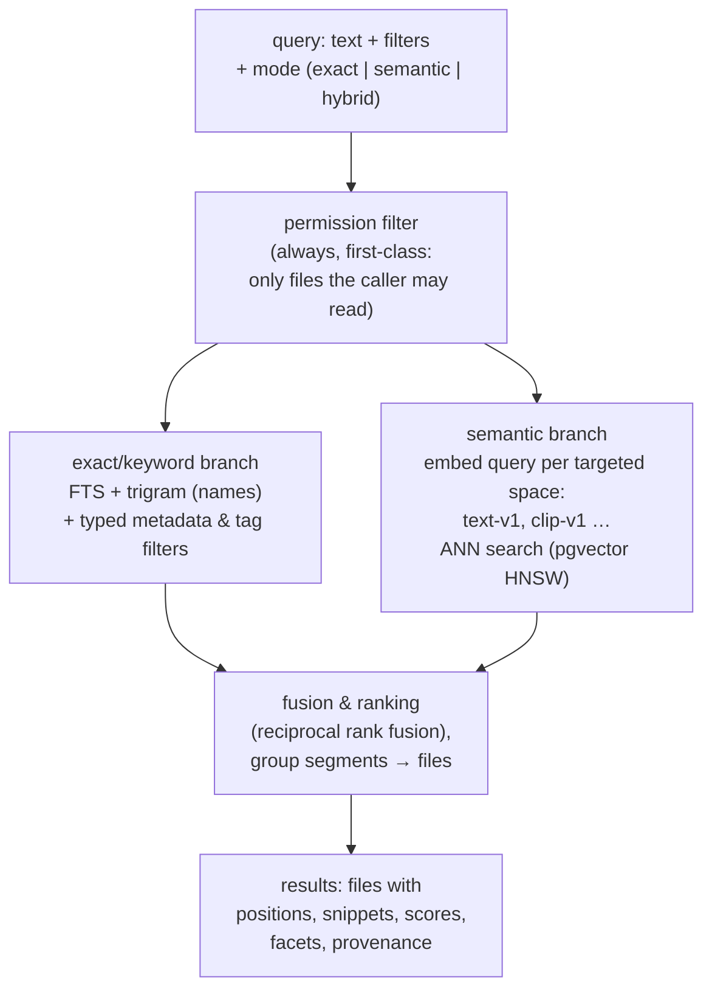

# 06 — Search

**Status:** Draft
**Related ADRs:** [ADR-0001](../decisions/ADR-0001-postgresql-single-datastore.md)

## Product definition

Search is the reason this app exists. Two complementary modes, one API:

1. **Exact / structured** — *"I know what's in it."* Exact text phrases, exact file names, exact metadata (key, value, date/time ranges), tags. Deterministic, filterable, no surprises.
2. **Semantic** — *"I only know the theme."* Embedding-based similarity over text content and image content (via a CLIP-class shared text–image space), so *"photo of my dog at the beach"* matches an image whose detected content is *dog, sand, ocean*.

Both return **positional results** wherever the file type reasonably allows: *document X, pages 1, 3 and 7 (with highlighted snippets)*; *video Y at 04:12 (with transcript snippet and keyframe)*.

## Query model



### Filters (composable with any mode)
`workspace`, `path prefix` (resolved to a folder subtree via the folder closure — [F-015](../features/F-015-folders.md)), `class` (core-assigned media class — [04](04-ingestion-pipeline.md#2-identification), [F-002/FR-15](../features/F-002-hybrid-search.md)), `file type/MIME`, `tag` (incl. provenance: e.g. only `manual`/`confirmed`), `metadata key/value/range` (dates, numbers; geo predicates below), `size`, `owner`, `has-pending-extraction`, `version scope`, `state` (lifecycle scope, below).

Tag filters **expand down the hierarchy by default** ([ADR-0006](../decisions/ADR-0006-hierarchical-tags-dag.md)): `tag:nature` matches files tagged with any descendant (`plant`, `tree`, …) via the precomputed closure table; `exact: true` restricts to the literal tag. Tags with status `suggested` are **excluded** from search, facets, and autocomplete until approved.

### Version scope
Default: **latest versions only**. Opt-in: search all versions / versions in a time range ([F-007](../features/F-007-versioning.md)); old-version hits are labeled as such.

### Lifecycle state scope
Default: **live items only**. Trashed items ([F-014](../features/F-014-deletion-and-trash.md)) are excluded from results, facets, counts, and autocomplete **by construction**: the `live` predicate is applied *inside* every query branch — including inside the pgvector ANN search, because post-filtering vector hits silently reduces recall — exactly like the permission filter, and tested with the same leak-test rigor ([11](11-engineering-standards.md#what-must-be-tested)). Opt-in: `state: trashed` (searching the trash requires the same permission as the trash listing) or `state: all`; trashed hits are labeled.

### Folders as results
Folders are searchable objects ([F-015/FR-10](../features/F-015-folders.md)): matched by name, manual tags, and metadata — they carry no content segments — and returned as folder-typed results alongside file hits, permission-filtered identically. A folder tag does **not** match the files inside the folder in v1 (query-time inheritance is deferred — Q23).

### Listing mode & sort
A request without query text (filters only) is a **listing**, not a ranked search ([F-002/FR-16](../features/F-002-hybrid-search.md)): the FTS/ANN branches are skipped and results are ordered by an explicit `sort` — `name`, `size`, `mtime`, `ingested` (version registration time), or a range-typed well-known metadata key (`taken_at`, `duration`) — with entries missing the key ordered last and ties broken by file id, keeping cursors stable. Folder-typed results join a listing only when the request filters on folder-matchable fields (name, tag, metadata); a bare listing returns files. Permission, version, and lifecycle predicates are identical to ranked search. This is what the library pages ([F-017](../features/F-017-views.md)) execute — a type tab is `class = video` + `sort: mtime desc`, nothing more.

### Geo queries & map aggregation
Geo-typed metadata ([02](02-domain-model.md#metadataentry) — well-known key `gps`) supports bounding-box and radius predicates inside any query branch ([F-002/FR-17](../features/F-002-hybrid-search.md)). For map rendering ([F-017](../features/F-017-views.md) map layout), a request may additionally ask for **grid aggregation** over a bbox + zoom ([F-002/FR-18](../features/F-002-hybrid-search.md)): grid cells with counts and a representative file id, individual hits below a per-cell threshold. Cell counts are computed *inside* the query exactly like facets — a cell count over unreadable or trashed files is a leak. Index: a GiST index over the geo values (built-in `point` operators, or PostGIS if adopted) — an implementation choice behind the search interface, under the same escape-hatch rule as ADR-0001.

### Views (stored requests)
Saved views ([F-017](../features/F-017-views.md)) store `POST /search` requests verbatim and add no machinery here: no snapshots, no per-view server state — every execution is an ordinary query through this pipeline, permission-filtered like any other.

## Index design (what makes positions possible)

The searchable unit is the **Segment** ([02-domain-model.md](02-domain-model.md#segment)), not the file:

- FTS index over segment text (per-segment `tsvector`; language-aware where detected).
- Trigram index over file names/paths for exact-ish and substring name search.
- Typed metadata table for range/equality filters.
- pgvector HNSW indexes per embedding space over segment embeddings.

Query flow: match *segments* → group by file → rank files (fusing each file's best segment scores) → return files with their matching segments as positions. One strong match should beat fifty weak ones; exact-phrase hits rank above fuzzy hits in hybrid mode. Precise scoring is an implementation detail to tune, not to spec.

### Two embedding spaces, never mixed
- `text-v1`: sentence-embedding space for document/transcript semantics.
- `clip-v1`: shared text–image space for visual semantics.
A hybrid query embeds the query text once per space, searches each space separately, and fuses ranked lists (RRF). Vectors from different spaces are never compared directly.

## Permission-aware by construction

Search results are filtered by the caller's read permissions **inside the query**, not post-hoc: a snippet from an unreadable file is a data leak. Public share-link tokens grant search access to nothing (links are download-scoped). This is a hard requirement driving the single-datastore choice (ADR-0001): permissions and index live in the same transactional store. The lifecycle-state predicate (above) rides the same mechanism — every filter that must never leak is applied inside the query.

## Result shape (API sketch)

```jsonc
{
  "results": [
    {
      "file": { "id": "…", "path": "docs/tax/2024.pdf", "workspace": "…" },
      "score": 12.4,
      "matches": [
        { "kind": "text", "anchor": { "page": 3 }, "snippet": "…the <em>heat pump invoice</em> from…" },
        { "kind": "text", "anchor": { "page": 7 }, "snippet": "…" }
      ],
      "why": ["exact-phrase", "tag:invoice(auto,0.91)"]   // explainability
    },
    {
      "file": { "id": "…", "path": "videos/talk.mp4" },
      "matches": [
        { "kind": "transcript", "anchor": { "t": 252.0 }, "snippet": "…" },
        { "kind": "keyframe", "anchor": { "t": 252.0 }, "preview": "/derived/…" }
      ]
    }
  ],
  "facets": { "class": {"document": 12, "video": 3}, "type": {"pdf": 12}, "tags": {"invoice": 9} },
  "pending": { "files_awaiting_extraction": 1042 }   // honest during initial 10 TB import
}
```

`why` (which signals matched, incl. tag provenance + confidence) keeps auto-derived results distinguishable and debuggable — the user can tell "found by manual tag" from "found by 0.62-confidence detection".

## Performance targets

| Aspect | Target |
|---|---|
| Interactive queries (p95) | < 500 ms on CPU-only hardware at ~10 TB / few million segments |
| Query embedding | query-side models stay resident in memory (no cold-start per search) |
| Ranking quality escape hatch | keyword/vector engine swap-in possible behind the search interface if PostgreSQL quality/perf ceiling is hit (ADR-0001 consequence) |
