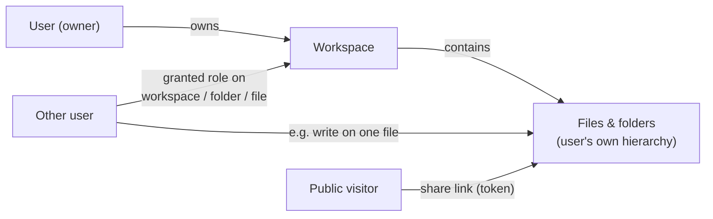

# 07 — Identity, Permissions, Sharing

**Status:** Draft

## Deployment reality

Installable on a private home machine *or* a public server. Therefore: real authentication, real permission checks on every API call, and permission-aware search — always on, even single-user (a single-user install is just an instance with one account).

## Users

- 10–30 accounts per instance, locally managed (no external identity provider required; SSO/OIDC is a possible later addition and must not be precluded by the API design).
- Roles at instance level: `admin` (manage users, extractors, reprocessing, instance settings) and `member`.

## Tokens & credentials

- **Personal access tokens**: high-entropy (≥ 256 bit), **prefixed** (e.g. `sepat_…` — recognizable to secret scanners), **hashed at rest** (SHA-256; the plaintext is shown exactly once, at creation), **scoped** to least privilege (e.g. read-only for an agent), individually revocable, with optional expiry and a rotation flow. Comparison in constant time. Last use is recorded (feeds audit and cleanup).
- **Session tokens**: short-lived; logout revokes.
- **Device pairing codes** ([F-019/FR-3](../features/F-019-mobile-connection.md)): one-time codes minted by an authenticated session (shown as a QR) and exchanged — unauthenticated, the code is the credential — for a device-named personal access token. High-entropy (≥ 128 bit), TTL ≤ 5 minutes, single-use, aggressively rate-limited like share-link password attempts, creation and every exchange attempt audited.
- **Credentials travel in the `Authorization` header — never in URLs or query strings** (query strings leak into proxy/access logs, browser history, and `Referer`). Two documented exceptions:
  1. **Share links** (`GET /shares/{token}`) are capability URLs *by design* — the URL being the credential is the feature. Mitigations: high-entropy tokens, expiry, revocation, per-access audit ([F-008](../features/F-008-sharing-and-public-links.md), [F-011](../features/F-011-audit-trail.md)), and a scope of download + preview only.
  2. **WebSocket authentication** ([F-012](../features/F-012-live-updates.md)): browsers cannot set headers on WS connects; the mechanism is open (Q18) — token-in-query is ruled out.

## Abuse protection

- **App-level rate limiting** per token→IP (client IP as forwarded by the edge — [ADR-0009](../decisions/ADR-0009-external-traefik-edge.md)), strict on `/auth/login` and on share-link **password attempts** (exponential backoff / temporary lockout). Public endpoints (share links) are limited most aggressively.
- Volumetric/DDoS-class abuse is absorbed at the edge (Traefik), never in the app ([10](10-deployment-and-operations.md#edge-vs-app-responsibilities)).
- Failed logins, lockouts, and rate-limit trips are security events in the event log ([F-011](../features/F-011-audit-trail.md)).

## Ownership and permissions

- **Owner**: full control over their workspace and everything in it.
- **Grants**: an owner can grant another user a role on a workspace, a folder subtree, or a single file. Folder grants anchor to the folder's **UUID** — they survive rename and move and are evaluated via the folder closure ([F-015](../features/F-015-folders.md)); moving an item into or out of a granted subtree changes effective permissions immediately:

| Role | Capabilities |
|---|---|
| `read` | see file, download, see tags/metadata, find it in search |
| `write` | `read` + upload new versions, edit **tags and metadata**, move/rename within granted scope |
| `manage` | `write` + grant permissions, delete (to trash), restore, purge ([F-014](../features/F-014-deletion-and-trash.md)) |

- **Shared truth:** tags/metadata belong to the file — when Bob (with `write`) edits tags on Alice's file, Alice sees Bob's changes ([02-domain-model.md](02-domain-model.md#file)). Provenance records *who*: manual tags carry the user id.
- Effective permission = union of grants (most permissive wins along the path). Fine-grained deny rules are out of scope for v1.

## Search and permissions

Search only ever returns files the caller can `read`, enforced inside the query ([06-search.md](06-search.md#permission-aware-by-construction)). This is non-negotiable and must be covered by tests from day one.

## Public share links ([F-008](../features/F-008-sharing-and-public-links.md))

- Token-based public URL for a file (later: folder), no account required.
- Scope: **download + view preview only.** No search, no tags/metadata browsing, no listing beyond the shared object.
- Options: expiry date, optional password, revocation, download counter.
- Created by anyone with `manage` on the target (owner by default).

## Deletion, trash, purge

Permission rules for the deletion lifecycle ([F-014](../features/F-014-deletion-and-trash.md)):

- Seeing a trash entry follows `read`, evaluated against the entry's original location; restore and purge require `manage` — the same bar as delete.
- Grants on trashed items are preserved but inert; share links are suspended, not revoked (whether they answer `404` or `410` is Q21), and resume working on restore.
- **Admins get no content access here either** — consistent with this spec's stance that instance admin ≠ data access: admins see aggregate trash statistics only ([09](09-previews.md#disk-usage-visibility)), never other users' trash entries. The instance-wide emergency empty-trash operation requires typed confirmation and is audited.
- Workspace deletion requires the exact workspace name as explicit confirmation and produces one restorable trash batch ([F-014/FR-13](../features/F-014-deletion-and-trash.md)).

## Audit

The system keeps a **full audit trail** of every state-changing action — see [F-011](../features/F-011-audit-trail.md) and the unified event log ([ADR-0007](../decisions/ADR-0007-unified-event-log.md)). Security-relevant events (logins, permission grants, share-link creation/access, deletions, reprocess triggers) are part of that single log: admins query instance-wide, users query activity on their own files.
