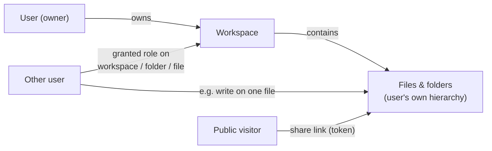

# 07 — Identity, Permissions, Sharing

**Status:** Draft

## Deployment reality

Installable on a private home machine *or* a public server. Therefore: real authentication, real permission checks on every API call, and permission-aware search — always on, even single-user (a single-user install is just an instance with one account).

## Users

- 10–30 accounts per instance, locally managed (no external identity provider required; SSO/OIDC is a possible later addition and must not be precluded by the API design).
- Roles at instance level: `admin` (manage users, extractors, reprocessing, instance settings) and `member`.
- **Accounts are created by admins. There is no self-registration** — an instance reachable from the internet must not accumulate accounts by itself, and at 1–30 users an invitation is a conversation, not a funnel.
- **Passwords** are stored as **argon2id** hashes (never anything reversible, never a bare digest), verified in constant time. Policy is NIST-style: a minimum length (12 characters) and no composition rules or forced rotation, because those produce weaker secrets in practice.
- **Bootstrap:** on start-up, if the instance has **zero** users and `SE_BOOTSTRAP_ADMIN_EMAIL`/`SE_BOOTSTRAP_ADMIN_PASSWORD` are set, one admin account is created and the event is audited. With users already present the variables are ignored (a start-up warning says so, so a stale value in `.env` is visible rather than mysterious). A CLI `create-admin` covers the deployment that would rather not put a password in the environment at all, and an instance with no users answers every authenticated call `401` — never a permissive fallback.

## Tokens & credentials

- **Personal access tokens**: high-entropy (≥ 256 bit), **prefixed** (e.g. `sepat_…` — recognizable to secret scanners), **hashed at rest** (SHA-256; the plaintext is shown exactly once, at creation), **scoped** to least privilege (e.g. read-only for an agent), individually revocable, with optional expiry and a rotation flow. Comparison in constant time. Last use is recorded (feeds audit and cleanup).
- **Session tokens**: opaque, high-entropy, **hashed at rest** like a PAT, with a rolling idle expiry (14 days) and immediate revocation on logout; a user can list their sessions and revoke any of them. For the browser they are delivered as a **`__Host-` prefixed cookie, `HttpOnly`, `Secure`, `SameSite=Lax`** — a token the page's JavaScript cannot read cannot be exfiltrated by a script injection, which is worth more here than the convenience of a bearer token in `localStorage`. CSRF protection is therefore explicit: `SameSite=Lax` plus an `Origin`/`Sec-Fetch-Site` check on every unsafe method, rejecting cross-site requests before they reach a handler. Non-browser clients use PATs in the `Authorization` header and never see a cookie.
- A second authentication factor (TOTP, passkeys) is post-v1 (Q56); the login endpoint's shape leaves room for a challenge step.
- **Device pairing codes** ([F-019/FR-3](../features/F-019-mobile-connection.md)): one-time codes minted by an authenticated session (shown as a QR) and exchanged — unauthenticated, the code is the credential — for a device-named personal access token. High-entropy (≥ 128 bit), TTL ≤ 5 minutes, single-use, aggressively rate-limited like share-link password attempts, creation and every exchange attempt audited.
- **Credentials travel in the `Authorization` header — never in URLs or query strings** (query strings leak into proxy/access logs, browser history, and `Referer`). Two documented exceptions:
  1. **Share links** (`GET /shares/{token}`) are capability URLs *by design* — the URL being the credential is the feature. Mitigations: high-entropy tokens, expiry, revocation, per-access audit ([F-008](../features/F-008-sharing-and-public-links.md), [F-011](../features/F-011-audit-trail.md)), and a scope of download + preview only.
  2. **WebSocket authentication** ([F-012](../features/F-012-live-updates.md)): browsers cannot set headers on WS connects; the mechanism is open (Q18) — token-in-query is ruled out.

## Abuse protection

- **App-level rate limiting** per token→IP (client IP as forwarded by the edge — [ADR-0009](../decisions/ADR-0009-external-traefik-edge.md)), strict on `/auth/login` and on share-link **password attempts** (exponential backoff / temporary lockout). Public endpoints (share links) are limited most aggressively.
- **A per-address ceiling only counts an address that identifies somebody.** Behind a proxy whose headers the app is not configured to trust — `SE_FORWARDED_ALLOW_IPS` empty, which is the documented default — every caller arrives as the proxy, so one address covers the whole instance: counting failed logins that way lets ten junk attempts lock every user out of logging in. So the app counts per address when the address is the caller's (proxy headers trusted, or no proxy in front) and not otherwise; the per-identity ceiling is unaffected. Events still record the address that was actually observed, marked as a proxy's so a later count knows to skip it — an audit trail that omits what it saw is worse than a thin one. A forwarding header is the caller's to set, so this is deliberately evadable by one caller in exchange for not being usable against everyone.
- **A credential that fails to authenticate is counted against something the caller does not choose.** The request ceiling is keyed on the presented credential, so rotating invalid ones would otherwise get a fresh bucket per request — unlimited unauthenticated work, one pooled connection each. Failures are charged per counting key (above) against a ceiling well below the request ceiling, in process; the *trip* is the security event, because recording every failure would let an attacker make the app write rows in the one table nothing deletes. A request carrying **no** credential is not a failed authentication and is refused before any connection is opened.
- Volumetric/DDoS-class abuse is absorbed at the edge (Traefik), never in the app ([10](10-deployment-and-operations.md#edge-vs-app-responsibilities)).
- Failed logins, lockouts, and rate-limit trips are security events in the event log ([F-011](../features/F-011-audit-trail.md)).
- **A run records who asked for it, not who is affected by it.** Work a person triggers — a manual re-scan today — is attributed to that person; the state it *discovers* is not. A scan's `workspace.scanned` names the requester, while the `file.created` events for files that were already on the disk stay `system`, because recording that someone created a file they merely caused the app to notice would be a false record rather than a thin one ([ADR-0007](../decisions/ADR-0007-unified-event-log.md), [F-011/FR-9](../features/F-011-audit-trail.md)).
- **Upload appends are charged by size, not by count.** An append carrying at least `Upload-Limit: min-append-size` does not count against the per-credential ceiling, because what that ceiling rations is per-request overhead — one `fsync` each — rather than throughput. The asymmetry is what makes the exemption safe: a *small* append can only breach a per-minute count if the link is fast, and a fast link has no reason to send small appends, while an attacker sending kilobyte appends spends the ordinary budget and stops. Session creation is counted normally, so nobody accumulates sessions to append to ([ADR-0017](../decisions/ADR-0017-resumable-upload-protocol.md)).

## Ownership and permissions

- **Owner**: full control over their workspace and everything in it.
- **Grants**: an owner can grant another user a role on a workspace, a folder subtree, or a single file. Folder grants anchor to the folder's **UUID** — they survive rename and move and are evaluated via the folder closure ([F-015](../features/F-015-folders.md)); moving an item into or out of a granted subtree changes effective permissions immediately:

| Role | Capabilities |
|---|---|
| `read` | see file, download, see tags/metadata, find it in search |
| `write` | `read` + upload new versions, edit **tags and metadata**, move/rename within granted scope |
| `manage` | `write` + grant permissions, delete (to trash), restore, purge ([F-014](../features/F-014-deletion-and-trash.md)) |

- **Shared truth:** tags/metadata belong to the file — when Bob (with `write`) edits tags on Alice's file, Alice sees Bob's changes ([02-domain-model.md](02-domain-model.md#file)). Provenance records *who*: manual tags carry the user id.
- **The tag vocabulary is instance-wide and the exception that proves the rule.** Any authenticated caller may read and complete it — a shared vocabulary nobody can browse is not usable — while *curating* it (create, rename, re-parent, alias, merge, delete, approve suggestions) is admin-only ([F-003/FR-10](../features/F-003-tagging.md)). That is instance administration, not data access: the words are global, but every count, listing and search built on them stays scoped to what the caller can see, admins included ([02 § Tag/FileTag](02-domain-model.md#tag--filetag)). Applying a tag to a file or folder needs `write` on that file or folder like any other edit.
- Effective permission = union of grants (most permissive wins along the path). Fine-grained deny rules are out of scope for v1.

### Visibility roots (what a grantee sees)

Ancestor names are content — a folder called `Divorce 2026` reveals as much as a document. Therefore, for every resource a caller can read, their **visibility root** is the topmost ancestor they can read, and everything above it **does not exist for that caller**: no names, no ids, no path segments, no counts, no events; a direct request for an unreadable ancestor returns `404` like any hidden resource ([08 § errors](08-api-principles.md#errors-rfc-9457)).

- A granted folder is presented as its own root — its plain name plus the granting owner — under **Shared with me** ([F-008/FR-10–11](../features/F-008-sharing-and-public-links.md)); a granted single file appears there with no parent reference at all. An owner is the degenerate case: their visibility root is the workspace root, so owners always see full workspace-relative paths.
- **Every path the API returns is rendered per caller at read time from folder ids** ([F-015/FR-12](../features/F-015-folders.md)); events and audit records store ids, never baked path strings. Search results follow the same rule ([06 § result shape](06-search.md#result-shape-api-sketch)); archive manifests already do ([F-016/FR-2](../features/F-016-archive-download.md)). Users' own file-activity views render caller-relative; the instance-wide admin audit ([F-011](../features/F-011-audit-trail.md)) is the one surface that renders full paths — it is admin-scoped by design.
- Admins get **no bypass** on regular data surfaces — consistent with this spec's stance that instance admin ≠ data access.
- The leak bar is [F-002/FR-7](../features/F-002-hybrid-search.md) rigor, written as its own negative requirement: [F-015/FR-13](../features/F-015-folders.md).

## Search and permissions

Search only ever returns files the caller can `read`, enforced inside the query ([06-search.md](06-search.md#permission-aware-by-construction)). This is non-negotiable and must be covered by tests from day one.

## Persons & face data ([F-018](../features/F-018-people.md) — deferred)

Biometric identity gets stricter rules than tags and metadata (rationale: [ADR-0011](../decisions/ADR-0011-person-recognition-architecture.md)):

- **Owner-scoped, never global.** Persons belong to the user whose workspaces the faces came from; identity resolution never matches faces across owners ([F-018/FR-14](../features/F-018-people.md)). The only cross-owner join is an explicit account link.
- **Visibility derives from file readability.** A caller observes a person iff they own it or can read ≥ 1 live file (in an effectively enabled workspace) carrying its appearance; any other person id answers `404`, indistinguishable from never-existed ([F-018/FR-26](../features/F-018-people.md)) — the visibility-roots bar, applied to persons. Person thumbnails are served only from files the caller can read ([F-018/FR-30](../features/F-018-people.md)).
- **Rights split like tags.** Person entity operations (name, hide, merge, delete, account link) are owner-only; `write` on a file curates that file's appearances (assign/confirm/reject) against the owner's existing, caller-visible persons — collaborators apply, they never mint ([F-018/FR-21–22](../features/F-018-people.md), the [F-003](../features/F-003-tagging.md) pattern).
- **Enablement and erasure are owner decisions.** Admins set the instance default (`disabled | default_off | default_on`) but have **no access to person data and no override of workspace settings** — instance admin ≠ data access, here most of all ([F-018/FR-1–7](../features/F-018-people.md)).
- **Account links are always visible to the linked account.** The person owner links; the linked user can list every link to their account and remove any of them; both directions are audited ([F-018/FR-31](../features/F-018-people.md); consent flow beyond self-unlink: [Q53](../OPEN-QUESTIONS.md)).
- **Share links expose zero person data** ([F-018/FR-28](../features/F-018-people.md)) — their scope stays download + preview only.

## Public share links ([F-008](../features/F-008-sharing-and-public-links.md))

- Token-based public URL for a file (later: folder), no account required.
- Scope: **download + view preview only.** No search, no tags/metadata browsing, no listing beyond the shared object.
- Options: expiry date, optional password, revocation, download counter.
- Created by anyone with `manage` on the target (owner by default).

## Deletion, trash, purge

Permission rules for the deletion lifecycle ([F-014](../features/F-014-deletion-and-trash.md)):

- Seeing a trash entry follows `read`, evaluated against the entry's original location; restore and purge require `manage` — the same bar as delete.
- Grants on trashed items are preserved but inert; share links are suspended, not revoked (whether they answer `404` or `410` is Q21), and resume working on restore.
- **Admins get no content access here either** — consistent with this spec's stance that instance admin ≠ data access: admins see aggregate trash statistics only ([09](09-previews.md#disk-usage-visibility)), never other users' trash entries. The instance-wide emergency empty-trash operation requires typed confirmation and is audited.
- Workspace deletion requires the exact workspace name as explicit confirmation and produces one restorable trash batch ([F-014/FR-13](../features/F-014-deletion-and-trash.md)).

## Audit

The system keeps a **full audit trail** of every state-changing action — see [F-011](../features/F-011-audit-trail.md) and the unified event log ([ADR-0007](../decisions/ADR-0007-unified-event-log.md)). Security-relevant events (logins, permission grants, share-link creation/access, deletions, reprocess triggers) are part of that single log: admins query instance-wide, users query activity on their own files.
