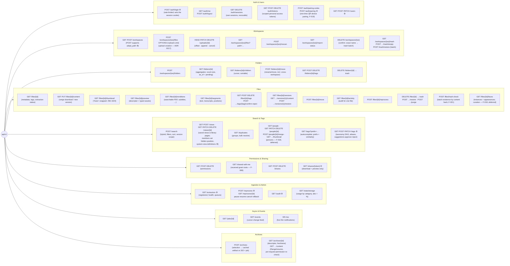

# 08 — API Principles

**Status:** Draft

## API-first, concretely

The HTTP API is the product's only interface. Rules:

1. **No capability exists outside the API.** The web UI, CLI, future mobile apps, sync clients, and local AI agents are all ordinary API consumers with no privileged side channels.
2. **The API ships before/with the UI** for every feature. A feature spec is not "done" until its API surface is defined.
3. **Machine-readable spec.** OpenAPI documents maintained as part of the codebase; generated clients must be feasible. **Two documents, two audiences** ([ADR-0020](../decisions/ADR-0020-extractor-dispatch-and-wire-protocol.md)): `openapi.json` is what a consumer of this product calls, and `openapi-extractor.json` is the contract an extractor image implements ([05](05-extractor-contract.md#dispatch--wire-protocol-extractor-apiv1)). They are disjoint and separately versioned, so an extractor author generates against the plugin boundary rather than against endpoints expecting a user credential.
4. **Stable versioning.** Path-versioned (`/api/v1/…`). Additive changes are free; breaking changes require `/v2` **plus a documented deprecation window** — `/v1` is never broken in place. Same philosophy as the extractor contract. API majors are deliberately **independent** of the app's SemVer and of the extractor-contract version: which app releases serve which majors is recorded in the support matrix ([11](11-engineering-standards.md#versioning--releases)).

## Conventions (proposed)

| Concern | Convention |
|---|---|
| Style | Resource-oriented REST, JSON; verbs only where operations aren't CRUD (`/search`, `/files/{id}/reprocess`, `/files/{id}/move`) |
| Search method | `POST /search` in v1, spec'd as *safe/idempotent*; the IETF `QUERY` method can be added as an alias once framework/proxy/tooling support matures — no breaking change |
| Auth | Token-based: personal access tokens + short-lived session tokens; scoped (e.g. read-only) so agents/integrations get least privilege. **Deny by default**: every endpoint declares its auth requirement — a missing declaration means *closed*, not open. Credentials travel in the `Authorization` header, never in URLs. Lifecycle, storage, and abuse protection: [07](07-identity-permissions-sharing.md#tokens--credentials) |
| Pagination | Cursor-based everywhere lists can grow (files, search results, audit log), one envelope: `{ "data": […], "next_cursor": "…" \| null }` — an unbounded list is never returned. Cursors are keyset-anchored (sort key + id tiebreak — [F-002/FR-16](../features/F-002-hybrid-search.md)): they stay valid under concurrent inserts and deletes; clients de-duplicate by id at page seams ([14](14-client-sync-and-caching.md#prefetch)) |
| Caching | Strong `ETag` on cacheable JSON reads (folder metadata/children, file metadata, views); `If-None-Match` match → `304`, empty body ([F-026/FR-25](../features/F-026-offline-cache-and-prefetch.md)). `Cache-Control` classes: JSON `private, no-cache` (storable, revalidate-always) · version-pinned derived assets `private, max-age=31536000, immutable` ([09 § thumbnails](09-previews.md#thumbnails), [F-026/FR-26](../features/F-026-offline-cache-and-prefetch.md)) · `no-store` on trash, audit, and share-viewer responses ([F-026/FR-19](../features/F-026-offline-cache-and-prefetch.md)). Client-side cache/invalidation contract: [14](14-client-sync-and-caching.md) |
| Long-running work | Async job resources: `POST` returns `202` + job id; `GET /jobs/{id}` for status/progress; ingestion/reprocessing statuses queryable per file and instance-wide. Jobs survive restarts; lifecycle mechanics (leases, retries, dead-letter): [12](12-reliability.md) |
| Events | Change feed (`/events` cursor endpoint) backed by the unified event log ([ADR-0007](../decisions/ADR-0007-unified-event-log.md)), plus a WebSocket channel pushing **thin, coalesced notifications** — clients refetch via the normal API ([F-012](../features/F-012-live-updates.md)). Webhooks possible later |
| Errors | RFC 9457 `application/problem+json`, one envelope everywhere — see [Errors](#errors-rfc-9457) below |
| Uploads | The **IETF resumable-upload protocol**, implemented in-app and the only upload path ([ADR-0017](../decisions/ADR-0017-resumable-upload-protocol.md)): creation carrying `Upload-Complete`, interim `104` + `Location`, `HEAD` offset probe, `PATCH` append (`application/partial-upload`), `DELETE` cancel, `OPTIONS` advertising `Upload-Limit`. Interop versions 9/8/6 from one dialect table; an unknown version is served as an ordinary upload. Requires an edge that forwards `1xx` and does not buffer request bodies ([10](10-deployment-and-operations.md#edge-vs-app-responsibilities)) |
| Downloads | Range requests supported (streaming video, extractor byte-range access). Content the *user* supplied is served **as a download unless its type is inert to render** — images other than SVG, audio, video, plain text — with `Content-Security-Policy: default-src 'none'; sandbox` and `X-Content-Type-Options: nosniff`: an uploaded `.html` is honest HTML, and serving it inline on the app's own origin would hand it the session cookie. Inline viewing of documents is the rendition path's job ([ADR-0008](../decisions/ADR-0008-renditions.md)), where we generated the bytes. The content hash is the `ETag` |
| Correlation | Every response carries `X-Request-Id`; errors repeat it as `instance`; every log line attaches it ([10](10-deployment-and-operations.md#logging)) |
| Payloads | `snake_case` JSON; typed request/response models, validated at the boundary; **unknown fields rejected**. (The extractor contract deliberately differs: the core *tolerates* unknown result fields for forward compatibility — [05](05-extractor-contract.md#compatibility-rules)) |
| Idempotency | `GET` safe; `PUT`/`DELETE` idempotent. Unsafe `POST`s (upload init, move, reprocess, share creation) accept an **`Idempotency-Key`**: a retry **replays the first execution's recorded outcome** instead of re-executing ([12](12-reliability.md#client-visible-idempotency)) — a response lost after commit must never double-execute; sync clients on flaky networks are a first-class future consumer. Outbound calls (extractor dispatch) always run with explicit timeouts and bounded retries ([04](04-ingestion-pipeline.md)) |
| CORS & headers | CORS deny-by-default with an explicit env-configured allow-list (the same-origin web UI needs none); content security headers set by the app; transport headers (HSTS) at the edge ([10](10-deployment-and-operations.md#edge-vs-app-responsibilities), [ADR-0009](../decisions/ADR-0009-external-traefik-edge.md)) |
| API docs | OpenAPI schema + interactive docs served **to authenticated users**, disable-able via env flag — a deliberate deviation from "no docs in prod": for a self-hosted API-first product the docs are a feature. Never unauthenticated |

## Errors (RFC 9457)

Every error is `application/problem+json` — one shape everywhere, so clients handle errors once:

```jsonc
{
  "type": "https://docs.store-everything.example/errors/validation",
  "title": "Validation failed",
  "status": 422,
  "detail": "2 request fields are invalid.",
  "instance": "req_01J8…",                              // = X-Request-Id of this request
  "errors": [                                            // validation: ALL problems at once
    { "detail": "must be a positive integer", "pointer": "/body/expiry_days" },
    { "detail": "unknown field",              "pointer": "/body/colour" }
  ]
}
```

- **Field-level validation** returns *all* problems in one response; each item is `{detail, pointer}` with an RFC 6901 JSON Pointer whose first segment names the location (`body` / `query` / `path` / `header`). Echo the field and the violated rule — **never the submitted value** (nothing sensitive is reflected back).
- **One exception to "our own type namespace":** where a wire protocol registers its own problem types, we send the registered URI. The only case is the resumable-upload offset mismatch (`…http-problem-types#mismatching-upload-offset`, [ADR-0017](../decisions/ADR-0017-resumable-upload-protocol.md)) — a client we did not write recognises *that* URI, and interoperating with it outranks a tidy namespace. The envelope's shape is unchanged.
- **Nothing internal leaks** — no stack traces, no SQL, no dependency error strings. The request id is the only bridge: the caller quotes `instance`, the operator finds the matching log line ([10](10-deployment-and-operations.md#logging)).
- **Status codes are honest**: `2xx` success · `400` malformed · `401`/`403` auth · `404` absent, *hidden by permissions*, or **purged** — existence is never leaked, and a purged id is indistinguishable from one that never existed ([F-008](../features/F-008-sharing-and-public-links.md), [F-014](../features/F-014-deletion-and-trash.md)) · `409` conflict · `410` expired/revoked share link (trashed targets: Q21), and content whose file is **in the trash** — the file is a real thing with a real history, so an authorized caller is told that rather than `404` ([F-014](../features/F-014-deletion-and-trash.md)) · `422` validation · `429` rate-limited, always with `Retry-After` so a client knows when to return ([07 § abuse protection](07-identity-permissions-sharing.md#abuse-protection)) · `5xx` server fault. Never `200` with an error body — and a `2xx` is sent only after the request's transaction has committed, so a failed commit is answered as a `5xx` rather than as a success over rolled-back rows ([12 § the request transaction](12-reliability.md#the-request-transaction)).
- **Auth failures are typed for cache policy**: a `401`'s problem `type` distinguishes re-authenticatable failures (token expired/revoked) from **terminal account states** (`account_disabled`, `account_deleted`), because clients react differently — lock-and-keep vs. immediate local wipe ([F-026/FR-11–13](../features/F-026-offline-cache-and-prefetch.md), [14 § auth-state policy](14-client-sync-and-caching.md#auth-state-policy-why-lock-then-wipe)). Terminal types reveal only what the failed login itself proves; they carry no further account data.

## Resource sketch (v1 surface, non-exhaustive)

```
/api/v1/auth/…                       POST /auth/login (public, rate-limited) · GET /auth/me ·
                                     POST /auth/logout · GET·DELETE /auth/sessions ·
                                     GET·POST·DELETE /auth/tokens; device pairing:
                                     POST /auth/pairing-codes (create one-time code) ·
                                     POST /auth/pairing (exchange, public — F-019)
/api/v1/users/…                      admin user management (list, create, read, patch;
                                     no delete in v1 — an account owns data, so removing
                                     one belongs with deletion & trash, F-014)
/api/v1/workspaces/…                 CRUD, adoption (point at an existing subtree — admin,
                                     allow-listed: ADR-0018), re-scan;
                                     DELETE requires confirm:"<name>" → restorable trash batch (F-014)
/api/v1/workspaces/{ws}/files/…      list/tree by path; POST = upload creation
                                     (OPTIONS advertises Upload-Limit — ADR-0017)
/api/v1/uploads/{id}                 upload resource: HEAD (offset) · PATCH (append)
                                     · DELETE (cancel) — the Location of a creation
/api/v1/workspaces/{ws}/folders      create folder (F-015)
/api/v1/workspaces/{ws}/trash        trash listing · POST …/trash/empty (F-014)
/api/v1/trash/restore                batch restore (batch id / item ids) (F-014)
/api/v1/folders/{id}                 metadata + aggregates (exact direct count; recursive
                                     count/size with as_of + pending);
                                     /children · /move (incl. cross-workspace) · /tags (F-015)
/api/v1/files/{id}                   metadata, tags, versions, extraction status
/api/v1/files/{id}/content           download (range), upload new version
/api/v1/files/{id}/thumbnail         uniform WebP thumbnail (?size= snapped to fixed set)
/api/v1/files/{id}/preview           preview descriptor + type-specific assets (09-previews.md)
/api/v1/files/{id}/renditions        enriched alternative forms: searchable PDF, subtitles… (ADR-0008)
/api/v1/files/{id}/segments          extracted text/positions (transcripts, pages)
/api/v1/files/{id}/tags              add/confirm/reject/remove (provenance-aware)
/api/v1/files/{id}/move              move/rename (first-class: auto-sort builds on this)
/api/v1/files/{id}/restore · purge   deletion lifecycle; DELETE /files/{id} → trash (F-014)
/api/v1/files/{id}/activity          audit trail for one file (F-011)
/api/v1/files/hash-check             batch content-hash existence check, scoped to the
                                     caller's owned live files (F-021)
/api/v1/search                       hybrid search (06-search.md); persons filter/facet (F-018, deferred)
/api/v1/duplicates                   duplicate groups, permission-scoped (F-013)
/api/v1/people                       persons (F-018, deferred): visible-person listing; rename, hide,
                                     merge, delete, account links (owner); {id}/thumbnail = cover crop
/api/v1/files/{id}/faces             face instances + person appearances; assign/confirm/reject (F-018)
/api/v1/views                        saved views & library pages (F-017): system + personal,
                                     per-user nav state; executed via POST /search — no own results endpoint
/api/v1/archives                     archive a selection (F-016); {id}/content = Range download
/api/v1/tags/…                       taxonomy (DAG), aliases, autocomplete; admin approve/reject suggestions
/api/v1/shared-with-me               received grant roots: topmost visible folders/files granted by
                                     others, with owner + role (F-008, 07 § visibility roots)
/api/v1/shares/…                     share links
/api/v1/extractors/…                 admin: registered extractors, health, queues
/api/v1/reprocess                    admin: trigger reprocessing (scoped)
/api/v1/audit                        admin audit query (F-011)
/api/v1/stats/storage                disk usage by category, absolute + % (09-previews.md)
/api/v1/jobs/{id}                    async job status
/api/v1/events                       change feed (cursor)
/api/v1/ws                           WebSocket: live thin notifications (F-012)

/healthz · /readyz                   liveness/readiness — outside /api/v1,
                                     unauthenticated by design (10-deployment-and-operations.md)
```

## Endpoint map (visual)

⚙ = admin-only · 🌐 = public (no account). Everything else requires an authenticated user and is permission-checked. The complete unauthenticated surface is deliberately tiny and documented: `POST /auth/login` (it is how a caller *obtains* a credential, so it cannot require one — shielded by rate limiting instead, [07](07-identity-permissions-sharing.md#abuse-protection)), `GET /shares/{token}`, `POST /auth/pairing` (one-time code is the credential — [07](07-identity-permissions-sharing.md#tokens--credentials), [F-019/FR-3](../features/F-019-mobile-connection.md)), `/healthz`, `/readyz` — any other public endpoint is a spec bug, and the test suite asserts the whole set by request rather than trusting review.



## Design constraints from deferred features

Don't build now, don't preclude either:

- **Mobile sync**: change feed + content hashes + resumable transfer are the primitives a sync client needs — all in v1 surface. The mobile apps now consume them ([F-021](../features/F-021-mobile-auto-upload.md), [13-mobile-clients](13-mobile-clients.md)); *desktop* sync clients remain the deferred consumer. The upload wire format is the IETF resumable-upload protocol precisely so the iOS system upload extension can drive the server directly ([ADR-0017](../decisions/ADR-0017-resumable-upload-protocol.md)).
- **Local AI agent**: scoped tokens + full API coverage means an agent can do anything a user can, with least privilege.
- **WebDAV / S3 compatibility**: protocol adapters mounted beside `/api/v1`, translating to the same core operations. Requires stable paths + move semantics (already first-class).
