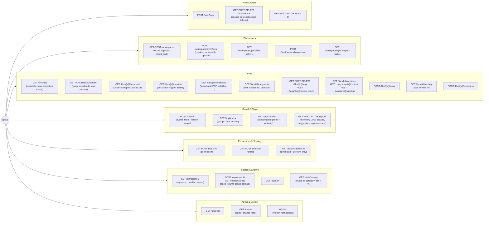

# 08 — API Principles

**Status:** Draft

## API-first, concretely

The HTTP API is the product's only interface. Rules:

1. **No capability exists outside the API.** The web UI, CLI, future mobile apps, sync clients, and local AI agents are all ordinary API consumers with no privileged side channels.
2. **The API ships before/with the UI** for every feature. A feature spec is not "done" until its API surface is defined.
3. **Machine-readable spec.** OpenAPI document maintained as part of the codebase; generated clients must be feasible.
4. **Stable versioning.** Path-versioned (`/api/v1/…`). Additive changes are free; breaking changes require `/v2` **plus a documented deprecation window** — `/v1` is never broken in place. Same philosophy as the extractor contract. API majors are deliberately **independent** of the app's SemVer and of the extractor-contract version: which app releases serve which majors is recorded in the support matrix ([11](11-engineering-standards.md#versioning--releases)).

## Conventions (proposed)

| Concern | Convention |
|---|---|
| Style | Resource-oriented REST, JSON; verbs only where operations aren't CRUD (`/search`, `/files/{id}/reprocess`, `/files/{id}/move`) |
| Search method | `POST /search` in v1, spec'd as *safe/idempotent*; the IETF `QUERY` method can be added as an alias once framework/proxy/tooling support matures — no breaking change |
| Auth | Token-based: personal access tokens + short-lived session tokens; scoped (e.g. read-only) so agents/integrations get least privilege. **Deny by default**: every endpoint declares its auth requirement — a missing declaration means *closed*, not open. Credentials travel in the `Authorization` header, never in URLs. Lifecycle, storage, and abuse protection: [07](07-identity-permissions-sharing.md#tokens--credentials) |
| Pagination | Cursor-based everywhere lists can grow (files, search results, audit log), one envelope: `{ "data": […], "next_cursor": "…" \| null }` — an unbounded list is never returned |
| Long-running work | Async job resources: `POST` returns `202` + job id; `GET /jobs/{id}` for status/progress; ingestion/reprocessing statuses queryable per file and instance-wide |
| Events | Change feed (`/events` cursor endpoint) backed by the unified event log ([ADR-0007](../decisions/ADR-0007-unified-event-log.md)), plus a WebSocket channel pushing **thin, coalesced notifications** — clients refetch via the normal API ([F-012](../features/F-012-live-updates.md)). Webhooks possible later |
| Errors | RFC 9457 `application/problem+json`, one envelope everywhere — see [Errors](#errors-rfc-9457) below |
| Uploads | Chunked/resumable for large files (multi-GB videos) |
| Downloads | Range requests supported (streaming video, extractor byte-range access) |
| Correlation | Every response carries `X-Request-Id`; errors repeat it as `instance`; every log line attaches it ([10](10-deployment-and-operations.md#logging)) |
| Payloads | `snake_case` JSON; typed request/response models, validated at the boundary; **unknown fields rejected**. (The extractor contract deliberately differs: the core *tolerates* unknown result fields for forward compatibility — [05](05-extractor-contract.md#compatibility-rules)) |
| Idempotency | `GET` safe; `PUT`/`DELETE` idempotent. Unsafe `POST`s (upload init, move, reprocess, share creation) accept an **`Idempotency-Key`** and dedupe retries — sync clients on flaky networks are a first-class future consumer. Outbound calls (extractor dispatch) always run with explicit timeouts and bounded retries ([04](04-ingestion-pipeline.md)) |
| CORS & headers | CORS deny-by-default with an explicit env-configured allow-list (the same-origin web UI needs none); content security headers set by the app; transport headers (HSTS) at the edge ([10](10-deployment-and-operations.md#edge-vs-app-responsibilities), [ADR-0009](../decisions/ADR-0009-external-traefik-edge.md)) |
| API docs | OpenAPI schema + interactive docs served **to authenticated users**, disable-able via env flag — a deliberate deviation from "no docs in prod": for a self-hosted API-first product the docs are a feature. Never unauthenticated |

## Errors (RFC 9457)

Every error is `application/problem+json` — one shape everywhere, so clients handle errors once:

```jsonc
{
  "type": "https://docs.store-everything.example/errors/validation",
  "title": "Validation failed",
  "status": 422,
  "detail": "2 request fields are invalid.",
  "instance": "req_01J8…",                              // = X-Request-Id of this request
  "errors": [                                            // validation: ALL problems at once
    { "detail": "must be a positive integer", "pointer": "/body/expiry_days" },
    { "detail": "unknown field",              "pointer": "/body/colour" }
  ]
}
```

- **Field-level validation** returns *all* problems in one response; each item is `{detail, pointer}` with an RFC 6901 JSON Pointer whose first segment names the location (`body` / `query` / `path` / `header`). Echo the field and the violated rule — **never the submitted value** (nothing sensitive is reflected back).
- **Nothing internal leaks** — no stack traces, no SQL, no dependency error strings. The request id is the only bridge: the caller quotes `instance`, the operator finds the matching log line ([10](10-deployment-and-operations.md#logging)).
- **Status codes are honest**: `2xx` success · `400` malformed · `401`/`403` auth · `404` absent *or hidden by permissions* (existence is not leaked — [F-008](../features/F-008-sharing-and-public-links.md)) · `409` conflict · `410` expired/revoked share link · `422` validation · `5xx` server fault. Never `200` with an error body.

## Resource sketch (v1 surface, non-exhaustive)

```
/api/v1/auth/…                       login, tokens
/api/v1/users/…                      admin user management
/api/v1/workspaces/…                 CRUD, import (point at existing subtree), re-scan
/api/v1/workspaces/{ws}/files/…      list/tree by path
/api/v1/files/{id}                   metadata, tags, versions, extraction status
/api/v1/files/{id}/content           download (range), upload new version
/api/v1/files/{id}/thumbnail         uniform WebP thumbnail (?size= snapped to fixed set)
/api/v1/files/{id}/preview           preview descriptor + type-specific assets (09-previews.md)
/api/v1/files/{id}/renditions        enriched alternative forms: searchable PDF, subtitles… (ADR-0008)
/api/v1/files/{id}/segments          extracted text/positions (transcripts, pages)
/api/v1/files/{id}/tags              add/confirm/reject/remove (provenance-aware)
/api/v1/files/{id}/move              move/rename (first-class: auto-sort builds on this)
/api/v1/files/{id}/activity          audit trail for one file (F-011)
/api/v1/search                       hybrid search (06-search.md)
/api/v1/duplicates                   duplicate groups, permission-scoped (F-013)
/api/v1/tags/…                       taxonomy (DAG), aliases, autocomplete; admin approve/reject suggestions
/api/v1/shares/…                     share links
/api/v1/extractors/…                 admin: registered extractors, health, queues
/api/v1/reprocess                    admin: trigger reprocessing (scoped)
/api/v1/audit                        admin audit query (F-011)
/api/v1/stats/storage                disk usage by category, absolute + % (09-previews.md)
/api/v1/jobs/{id}                    async job status
/api/v1/events                       change feed (cursor)
/api/v1/ws                           WebSocket: live thin notifications (F-012)

/healthz · /readyz                   liveness/readiness — outside /api/v1,
                                     unauthenticated by design (10-deployment-and-operations.md)
```

## Endpoint map (visual)

⚙ = admin-only · 🌐 = public (no account). Everything else requires an authenticated user and is permission-checked. The complete unauthenticated surface is deliberately tiny and documented: `GET /shares/{token}`, `/healthz`, `/readyz` — any other public endpoint is a spec bug.



## Design constraints from deferred features

Don't build now, don't preclude either:

- **Mobile sync**: change feed + content hashes + resumable transfer are the primitives a sync client needs — all in v1 surface.
- **Local AI agent**: scoped tokens + full API coverage means an agent can do anything a user can, with least privilege.
- **WebDAV / S3 compatibility**: protocol adapters mounted beside `/api/v1`, translating to the same core operations. Requires stable paths + move semantics (already first-class).
