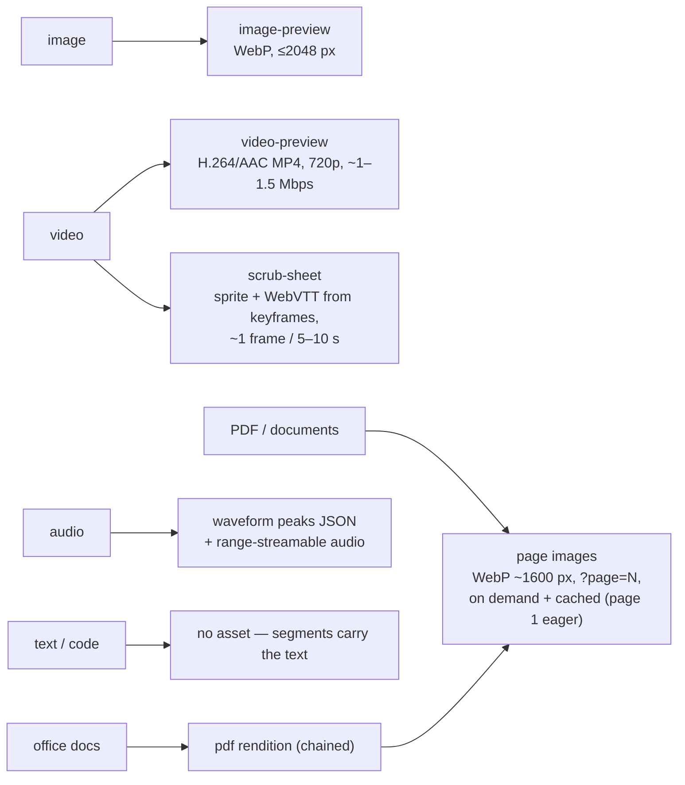

# 09 — Previews & Thumbnails

**Status:** Draft
**Related:** [ADR-0008 (renditions)](../decisions/ADR-0008-renditions.md), [05-extractor-contract](05-extractor-contract.md), [04-ingestion-pipeline — Prioritization & scheduling](04-ingestion-pipeline.md#prioritization--scheduling)

## Three tiers

| Tier | What it is | Uniformity |
|---|---|---|
| **Thumbnail** | One small raster image per file, for grids/lists | Strictly uniform: one format, fixed size set, semantics identical for every file type |
| **Preview** | Richer, type-specific representation for the detail/viewer page | Uniform *interface* (descriptor), type-specific *content* |
| **Rendition** | Downloadable alternative full-file form (searchable PDF, subtitled video) | See ADR-0008 |

Formats are fixed **per tier and per preview kind** (never one global format): each kind has exactly one pinned format + parameters, versioned like extractor models — changing parameters (e.g. 720p → 1080p) makes files eligible for regeneration through the normal generation mechanism.

## Thumbnails

- **Format:** WebP, aspect-preserved, longest edge in a fixed size set: **256 px** (grids) and **1024 px** (large tiles / lightbox warm-up).
- **API:** `GET /files/{id}/thumbnail?size=N` — the server *snaps* N up to the nearest generated size (ask 300, get 1024). Not free-form resizing: fixed sizes bound storage and keep URLs immutable/cacheable (keyed by file version + size). A request may **pin the version**: `?v={version}` returns that version's thumbnail (any existing version of a readable file — [F-007](../features/F-007-versioning.md)) with `Cache-Control: private, max-age=31536000, immutable`; without `v` the current version is served without the immutable marker ([F-026/FR-26](../features/F-026-offline-cache-and-prefetch.md)). Listing rows carry the current version id ([F-002/FR-20](../features/F-002-hybrid-search.md)) so clients construct pinned URLs without extra requests.
- **Aspect ratios are a client concern.** The server never produces per-layout variants; grids crop via `object-fit: cover`, masonry uses the intrinsic dimensions from file metadata. (Attention/face-aware smart cropping: possible later, server-side, not v1.)
- **Source per type:** image → downscale · video → representative keyframe (non-black/blurry heuristic over already-extracted keyframes) · PDF/document → rendered page 1 · audio → embedded cover art, else waveform image · otherwise → **no thumbnail**: the endpoint returns a clear "none" and clients fall back to a type icon.
- **Generated eagerly at ingest** for every file (priority class P1 — a file browser with holes feels broken).
- **Placeholder hash:** alongside each thumbnail, `preview-gen` emits a compact placeholder (thumbhash-class, tens of bytes) stored as the well-known metadata key `placeholder_hash` ([02](02-domain-model.md#metadataentry)) and returned inline in listings via the compact projection ([F-002/FR-20](../features/F-002-hybrid-search.md)) — grids render aspect-correct blurred cells with zero extra requests while thumbnails load. Same eagerness (P1), same regeneration mechanics as thumbnails.
- **Client caching:** because URLs are immutable per (file version, size), clients cache thumbnails indefinitely without revalidation ([13-mobile-clients](13-mobile-clients.md#caching-downloads-integrity)); a changed file is a new version and therefore a new URL. The cross-client cache, offline, and invalidation contract is [14-client-sync-and-caching](14-client-sync-and-caching.md). Whether a 512 px tier joins the fixed size set for high-density mobile grids is [Q42](../OPEN-QUESTIONS.md).
- A thumbnail is always **one static image**. Hover-scrub in grids is the client layering the *scrub sheet* (below) over the thumbnail element — never the original file (range-fetching video in grid cells is out of the question).

## Previews

`GET /files/{id}/preview` returns a **descriptor**, not bytes: JSON listing which preview assets exist (or are producible) for this file — kind, format, dimensions/duration/page count, URLs. Clients render what the descriptor offers instead of guessing by MIME type; a plugin producing a new preview kind (e.g. 3D-model turntable) just appears in descriptors, no core change.



Notes:

- **Video preview keeps full frame rate** at reduced resolution/bitrate — lowering fps saves little bitrate (encoders spend almost nothing on similar frames) and looks broken. The "low-fps" artifact is the **scrub sheet**: timeline hover, jump-to-search-hit at a timestamp, grid hover-scrub. It is nearly free — recycled from the keyframes the pipeline already extracted.
- **PDF pages are never pre-rendered in bulk** (300-page docs × millions of files ≈ pure waste). Page 1 is eager (it is the thumbnail source); other pages render on demand in tens of milliseconds and are cached. A search hit on page 40 fetches exactly page 40. Client-side rendering of the original (pdf.js) is a possible later *viewer* strategy; the API keeps server-rendered page images regardless — search-hit snippets, quick-look, and non-browser clients need images, not a PDF engine.
- **Ownership:** the generic `preview-gen` extractor owns thumbnails + image previews; type-specific assets live with the extractor that understands the type (`video-keyframes` → scrub sheet; the video transcoder is its own heavy cost class; PDF page rendering sits beside `pdf-text`). Declared via the normal manifest.

## Generation policy

Priorities per [04 — Prioritization & scheduling](04-ingestion-pipeline.md#prioritization--scheduling):

| Asset | When |
|---|---|
| Thumbnails, image previews, waveforms, scrub sheets | eager at ingest (P1 — cheap, always there) |
| Video preview transcodes | **eager by default at idle priority (P3)** — trickles through after search-critical work; per-workspace switch to on-demand for archival video dumps |
| PDF pages beyond page 1 | on demand (P0 — someone is waiting) + cache |
| Heavy renditions (e.g. muxed subtitled video) | on demand via "Generate" (P0) + cache — ADR-0008 |

Accepted cost (explicit decision): thumbnails and previews consume additional disk — roughly 10–20 % of video size for preview transcodes, negligible for the rest.

## Storage

All assets live in the app-owned **derived store** (never the source tree — portability; never the DB — only `DerivedAsset` pointer rows there), addressed by **content hash** + kind + parameters in sharded directories:

```
derived/{hh}/{content-hash}/thumb-256.webp
derived/{hh}/{content-hash}/thumb-1024.webp
derived/{hh}/{content-hash}/preview.mp4
derived/{hh}/{content-hash}/scrub.webp + scrub.vtt
derived/{hh}/{content-hash}/page-0001.webp …
```

Content-hash keying gives derived-data dedup for free: duplicate files share one set of assets. Everything is regenerable; cache-like kinds (PDF pages, on-demand transcodes/renditions, selection archives — [F-016](../features/F-016-archive-download.md)) are evicted LRU under a size cap. Archives additionally carry a short TTL and are evicted *before* other kinds under pressure — they are keyed by their permission-filtered manifest hash and rebuild on demand.

## Disk-usage visibility

`GET /stats/storage` reports usage by category — originals, version history, **trash** (content lives in `versions/` but reports as its own category — [F-014](../features/F-014-deletion-and-trash.md)), and derived by kind (thumbnails, previews, renditions, caches incl. archives) — as absolute bytes **and percent**, instance-wide for admins and per-workspace for owners. Sizes come from `DerivedAsset`/version rows (aggregation, not new bookkeeping). For admins the trash figures are aggregates only — never entry listings ([07](07-identity-permissions-sharing.md#deletion-trash-purge)).
