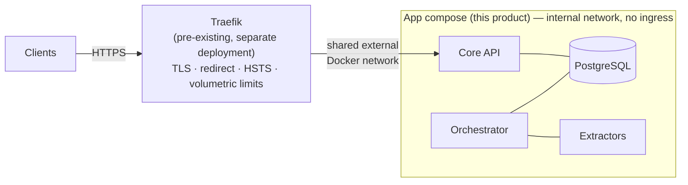

# 10 — Deployment and Operations

**Status:** Draft
**Related ADRs:** [ADR-0005](../decisions/ADR-0005-single-server-docker-network.md), [ADR-0009](../decisions/ADR-0009-external-traefik-edge.md)

## Topology

The whole app is one Docker Compose deployment on one server (ADR-0005), attached to an **existing, externally managed Traefik** (ADR-0009):

Rules:

1. **Only the core API joins the Traefik network.** Orchestrator, PostgreSQL, and extractors live on the internal network with no ingress; extractors additionally have no egress by default (Q7).
2. The API serves **plain HTTP internally**; TLS exists only at the edge.
3. **The API and the orchestrator are separate processes** from the same image, differing
   only in their command (`store-everything worker`). Background work must never be able to
   starve request handling of CPU ([04 § prioritization](04-ingestion-pipeline.md#prioritization--scheduling)),
   the two scale independently, and either can be restarted without the other. Running no
   worker at all is a valid degraded mode: queued work waits, and reads keep working.
4. **The API container also serves the built web UI** ([ADR-0014](../decisions/ADR-0014-vue-frontend-stack.md)) — one image, one origin, so the SPA needs no CORS entry and the session cookie is same-site by construction ([07](07-identity-permissions-sharing.md#tokens--credentials)). API routes live under `/api/v1`; everything else falls back to the SPA's entry document.
5. `X-Forwarded-*` is trusted **only from the proxy network** — a spoofed client IP would poison rate limiting ([07](07-identity-permissions-sharing.md#abuse-protection)) and audit records ([F-011](../features/F-011-audit-trail.md)).
6. The app is **proxy-agnostic**: nothing depends on Traefik specifics; any reverse proxy works by translating the shipped labels. Traefik is the documented first-class path.
7. Local development runs without a proxy (localhost bind, plain HTTP).
8. **The runtime image contains no package installer.** The virtualenv is built at image-build time and copied in; `pip` and `ensurepip` are removed. A running container therefore cannot install code, and the image does not inherit pip's vendored dependency tree — which is otherwise its only source of CVEs. Enforced in CI ([11](11-engineering-standards.md#ci-pipeline-the-enforcement-list)).

## Edge vs. app responsibilities

| Concern | Lives in |
|---|---|
| TLS + certificate management | Traefik |
| HTTP→HTTPS redirect, HSTS | Traefik |
| Volumetric / DDoS-class rate limiting | Traefik |
| Per-token/per-IP rate limits; login & share-password brute-force protection | App ([07](07-identity-permissions-sharing.md#abuse-protection)) |
| CORS (deny by default, explicit allow-list) | App ([08](08-api-principles.md)) |
| Content security headers (`nosniff`, frame-deny) | App |

### What the proxy must not break (uploads)

The resumable-upload protocol ([ADR-0017](../decisions/ADR-0017-resumable-upload-protocol.md)) puts three requirements on whatever sits in front of the app. They are configuration, not code, so they belong in the operator documentation — and each one fails as "large uploads mysteriously break", which is why they are named here:

1. **`1xx` interim responses must reach the client.** The `104 (Upload Resumption Supported)` response *is* the signal that resumption is available; Apple's background uploader treats it as authoritative. Traefik's default proxy forwards `1xx`; its experimental fast proxy does not.
2. **Request bodies must not be buffered.** Buffering defeats streaming and delays the `104` until the body is complete, which is the opposite of the point.
3. **Request timeouts must accommodate a whole upload.** Traefik's `respondingTimeouts.readTimeout` defaults to **60 s and covers the entire request including its body**, so every upload slower than a minute dies until it is raised. The app publishes `Upload-Limit: max-append-size` so clients can size appends under an intermediary's body limit instead of guessing.

## Health & readiness

- `GET /healthz` — liveness: the process is up. Unauthenticated **by design** (one of the documented public exceptions — [08](08-api-principles.md)); reveals nothing (no version, no internals).
- `GET /readyz` — readiness: database reachable, migrations current. Used by compose healthchecks and Traefik's health check.

## Configuration & secrets

- 12-factor: **deployment config comes from the environment** — never hardcoded, never committed. The compose file reads a git-ignored `.env`; a committed `.env.example` documents every variable with dummy values. (Domain configuration — workspaces, extractors, users — is data and lives in PostgreSQL, [03](03-storage-and-portability.md).)
- **Secrets** (DB password, token-signing key, remote-extractor credentials) are env-provided, held in secret types in code, **never logged**, never baked into images or layers.
- Credentials for network-enabled extractors are per-extractor env config — never in the manifest ([05](05-extractor-contract.md#container-requirements-hardening), Q19).

## Logging

- Structured (JSON) to **stdout** only. The app never writes or rotates log files — persistence and retention are the platform's concern (Docker logging driver).
- Level is env-configurable, default `INFO` in production. Levels are used deliberately (`DEBUG` dev detail · `INFO` milestones · `WARNING` degraded · `ERROR` operation failed · `CRITICAL` service-threatening); log the cause, not just the symptom.
- Every request gets a **request id** ([08](08-api-principles.md#errors-rfc-9457)); every log line carries it — it is the only bridge between a client-visible error and the internal cause.
- **Logs never contain secrets, tokens, file contents, search queries, or result snippets.** File paths appear at `DEBUG` only. For a product whose pitch is local-first privacy, leaking user data into logs is a breach, not an inconvenience.

## Upgrades & migrations

- An upgrade is: pull new images → `docker compose up`. Release notes state the contained migrations and the support-matrix entry ([11](11-engineering-standards.md#versioning--releases)).
- Every schema change ships as a **versioned migration** committed with the code — never hand-run DDL against a live database.
- Migrations are **expand–contract**: the *previous* app version must run against the migrated schema, because rollback is "redeploy the previous image".
- Both directions (`up` **and** `down`) are tested in CI ([11](11-engineering-standards.md#testing)).
- Migrations are **crash-safe**: transactional where PostgreSQL allows (one migration = one transaction); non-transactional steps (`CREATE INDEX CONCURRENTLY`, …) must be internally idempotent (`IF NOT EXISTS`-style guards) so a run killed halfway converges on retry. A **single-runner lock** keeps two containers racing at startup from double-applying ([12](12-reliability.md#startup-deploys-shutdown)).
- *When* migrations execute (automatically at startup with a pre-flight dump vs. an explicit separate step) is open — Q20.

## Crash resistance (ops view)

The app is **crash-only** ([ADR-0010](../decisions/ADR-0010-crash-only-execution-model.md), [12](12-reliability.md)): stopping it at any moment — `docker compose down`, `kill -9`, power loss — is safe, and interrupted work resumes after restart. Operationally that means:

- **PostgreSQL durability is non-negotiable:** `fsync = on` and `synchronous_commit = on` (the defaults) stay on; WAL lives on reliable storage. Every guarantee in [12](12-reliability.md) stands on the database not lying about commits.
- **`stop_grace_period` is sized for checkpoint-and-release (seconds), never for job duration.** A graceful stop just releases leases so the successor resumes instantly; a hard kill merely waits out lease expiry.
- **Crash resistance is not backup** (Q13): leases and idempotent recovery survive *process* death, not *disk* death.

## Disk space

Disk exhaustion is an operational emergency the system must survive politely — never a reason to destroy data ([F-014/FR-9](../features/F-014-deletion-and-trash.md)):

- **Monitored volumes:** source tree(s), derived store, `versions/`, PostgreSQL. Admin-configurable warn/critical thresholds (proposed defaults: 90 % / 95 %) emit alert events surfaced to admins; email/push delivery arrives with the future notification feature.
- **When a volume is full:** operations that need space — uploads, version snapshots, trash safeguarding ([03](03-storage-and-portability.md#deletion--trash)), rendition/archive builds — fail with a documented out-of-space problem type ([08](08-api-principles.md#errors-rfc-9457)) naming the affected volume. Reads and search keep working.
- **Freeing space:** users empty their trash; admins may early-purge with typed confirmation (audited); cache-like derived kinds (PDF pages, renditions, archives) are LRU-evicted automatically — they are regenerable, trash is not. **Purge and empty-trash are never blocked by a full disk.**
- The system never deletes non-regenerable data on its own to free space — no automatic early purge of trash, ever. Humans are alerted; humans act.

## Backups & restore

The backup story is deliberately still open — scope, schedule, and mechanics are **Q13** and must be resolved before v1 ships. What is already fixed:

- **Mandatory scope** (exists nowhere else): PostgreSQL (manual tags/confirmations/rejections, users, permissions, shares, event log) and the `versions/` area — the **only copy** of superseded originals ([03](03-storage-and-portability.md#versioning-vs-the-folder-is-everything-known-tension)).
- **Deliberate decision needed**: the derived store is regenerable, but re-deriving 10 TB on CPU-only hardware costs weeks — backing it up may be cheaper than recomputing.
- **Explicitly the user's job**: the source tree is the user's own data; backing it up is their responsibility — the app documents this loudly rather than assuming it silently.
- A restore that has never been exercised is not a backup: the procedure ships **documented and tested**.
